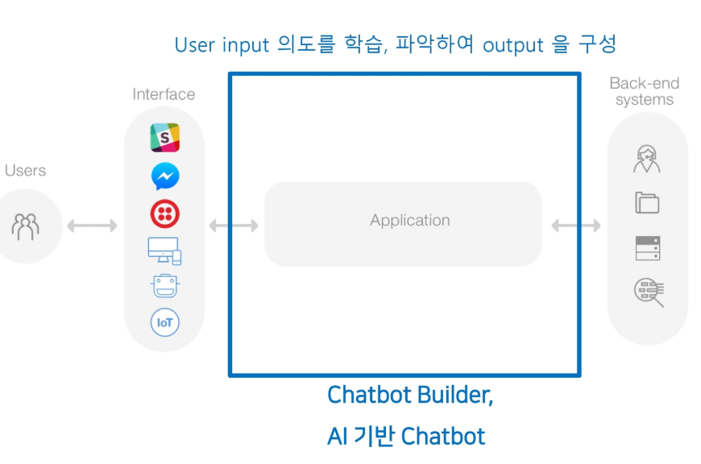

# Chatbot

- 텍스트나 음성으로 인간과의 대화를 통해 동작하는 모든 프로그램

- Turing Test : 기계가 인간과 구분할 수 없을 정도로 대화가 가능하다고 판단되면(30%이상) , 기계가 지능이 있다고 판별하는 테스트

- why Chatbot?
  - Interface의 진화
    - Commane Line => Graphic user => Touch => Voice => No Interface

<br>

- 도입 효과
  - 상담 인력 상당 부분 대체 & 생산성 향상
  - 24/7 운영 가능
  - 다양한 마케팅 메시지 push
  - 웹페이지 pop-up보다 부정적인 반응이 낮음

<br>

- 장점
  - 무중단 서비스
  - 채널 확장성 높음
    - 웹, 모바일웹, 메신저 서비스 통합, 인공지능 스피커
  - 데이터 분석 용이
    - 사람들이 자연어로 요청을 하므로 무엇을 원하는지 파악 가능
    - 클릭이나 터치에 비해 디테일한 니즈 분석 가능

<br>

- 단점
  - 학습 되지 않은 요청에 대해서는 응답 x
  - 기계와 대화 한다는 불편함
  - 

<br>

<br>

### chatbot의 형태

- in-app/in-web 또는 메신저 통합
  - 뱅킹 앱의 chatbot
  - 카카오 친구

<br>

- in-device
  - Clova, 기가 지니, Nugu
  - Siri, Google Assistance

<br>

- Robot

<br>

<br>

# 1. Chatbot 유형


<br>

### Rule Based Model

- 한정적인 도메인
- 높은 **신뢰도** 필요
- 특정 영역에 특화된 Chatbot에 적합
  - 법률, 금융, 유통, 여행

<br>

<br>

### AI Model 

- 학습에 의해서 스스로 답변을 만들어냄
- 범용적인 도메인
- 높은 **복잡성** 요구

- 범용 Chatbot에 적합
  - Google Assistant, Bixby 


<br>

<br>

## 2. Chatbot의 구조

> 

- 사용자 의도 = Intent

- User input 의도를 파악하는 것이 중요!

<br>

<br>

<br>

## 3. Chatbot Builder

> Chatbot 서비스를 만드는 툴을 총칭

<br>

- Clova Chatbot Builder, danbee.AI(LG CNS), kakao i open builder, A-Chat(SK C&C), PINGPONG
- Dialogflow - 구글이 제공하는 Builder, Chatful
- Watson Assistant - IBM 제공

<br>

### 체크 리스트

- 사용자 인터페이스로 선택한 메신저 등과 연동이 되는가
- 외부 API와의 연동성

<br>

<br>

## 4. Chatbot Service

- eBay 'ShopBot' : 페이스북 메신저 기반의 상품 검색/추천 Chatbot
- 스타벅스 Chatbot 'Barista' : 음성 인식 기반
- 마스터 카드 'Mastercard Bot'
- 리브똑똑, 쏠(쏠메이트 ORORA), 위비톡SORI

<br>

<br>

## 5. Dialogflow 

- python 설치
- pycharm 설치

- line 설치

<br>

### 1. Create Agent

### 2. Create Intents 

- 입력 문장이 어떤 의도인지 분류하기 위한 기준

- 사용자의 의도(질문)에 대해 어떻게 대답할것인지

<br>

<br>

### ask 라는 Intent

- ADD Training phrases

  > 

<br>

- Add Response

  > 

<br>

- Chatbot Simulator

  > 

<br>

<br>

### 3. Entity

- 입력 문장 속에서 원하는 정보를 추출하여 적절하게 대화를 이끌어 나갈 수 있도록 설정하는 단어 집합
  - ex) **페퍼로니 피자** 먹고 싶어
  - ex) 티셔츠 **화이트** 색상으로 **2**개 주문해줘

<br>

- Entity 종류

  - 시스템 Entity 
    - 기본적으로 제공 되는 Entity
    - 날짜, 수령, 색상, 시간 등

  <br>

  - 사용자 정의 Entity
    - 사이즈 - 105,100,XL / 메뉴 - 치킨, 족발

<br>

<br>

### 4. Flow, Context, Scenario

- 대화의 흐름
  - 주문 시작 뒤 메뉴 선택, 수량 선택, 주소 알려주고 확인하고 종료하는 일련의 흐름

<br>

- 대화의 흐름을 컨트롤하는 방식
  - bot마다 다름
  - 하나의 Intent에 후속 Intent를 연결하는 방식
  - Graph를 그리고 노드에 Intent를 연결하는 방식

<br>

<br>

### 5. 대화의 종류

- Welcome
- Push
  - Chatbot이 먼저 말을 거는 형태 - 쿠폰 등

<br>

- Fallback
  - 에러처리, 사전에 학습되지 않은 질문, 사용자의 오타

<br>

- Reconfirm
  - 사용자의 요청이 명확하지 않은 경우 재확인
  - ex ) 요금을 조회하시겠습니까?
  - ex ) 요금을 납부하시겠습니까?

<br>

<br>

## 6. FAQ Bot

- CGV FAQ 데이터 이용

<br>

- vip-selection : vip 선정 기준 Intent
- ticket-cancel : 예매 취소
- check-booking : 예매 내역 확인
- change-payment-method : 결제 수단 변경 문의
- change-user-id : 아이디 변경 문의

<br>

<br>

### 라인 채널 생성

- menu - Integrations - 라인 메신저 Enable
- 브라우저에서 https://developers.line.biz/en/ 접속
- Line 계정으로 로그인

<br>

<br>

### 라인 메신저 연결

- Dialogflow에서 Channel id, Channel Secret, Channel Access Token 입력
- Channel id, Channel Secret => Basic settings 탭에서 확인
- Channel Access Token => Messaging API 탭에서 확인 
- Webhook URL 복사 => Line Messaging API에서 Webhook URL 설정 저장

- QR 코드로 BOT 확인

<br>

<br>

## 7. Flask 를 활용한 Fulfillment 실습

- Dialogflow Intent에서 외부 API호출
- Dialogflow 의 Fulfillment 적용을 위해 Flask 사용

<br>

### Flask

- HTTP API제공
- Dialogflow에서 Flask의 API호출

<br>

### Flask를 이용한 웹(백엔드) 개발

- 클라이언트의 요청을 받아 처리하고 DB와 연동하여 데이터를 저장, 조회하는 개발

  > 

<br>

<br>

### 플라스크 설치

- 설치

  ```bash
  pip install Flask
  ```

  <br>

- 확인

  ```bash
  pip list
  ```

<br>

<br>

### hello_world.py 실행

- hello_world.py

  ```python
  from flask import Flask
  
  app = Flask(__name__)
  
  @app.route('/')
  def index():
      return "Hello World!!"
  
  @app.route('/user')
  def fet_user():
      return "Hello User!!"
  @app.route('/post')
  def get_post():
      return "Hello Post!!"
  
  @app.route('/user/list')
  def get_user_list():
      return "Hello User List!!"
  
  
  if __name__ == '__main__':
      app.run(debug=True)
  ```

<br>

- localhost:5000 접속

- `@app.route` decorator가 붙은 함수들은 Flask가 인식
  - `@app.route("/user")`를 붙인 경우 `/user` 로 호출이 들어오면 해당 함수를 호출
  - Flask Framework이 호출
  - Framework내부에 `/user`  **get_user**함수로의 매핑 정보를 가지고 있음

<br>

<br>

### PostMan 활용

<br>

<br>

### HTTP

- 웹 상의 문서를 교환하기 위한 규약
- Protocol : 규약
  - TCP, IP, FTP

<br>

- URI
  - 웹 상의 특정 자원을 찾을 수 있는 주소
  - ex) http://localhost:5000, naver.com, google.com

<br>

<br>

<br>

## 8. HTTP Request Data

- Request로 쿼리 넘기기

  ```python
  from flask import Flask, request
  
  app = Flask(__name__)
  
  @app.route('/query')
  def index():
      args = request.args
      id = args.get('id')
      print(id)
  
      return "Query String"
  
  if __name__ == '__main__':
      app.run(debug=True)
  ```

  <br>

- 실행

  - http://127.0.0.1:5000/query?id=1 접속
  - **Query String**이 출력되는것을 볼 수 있다

<br>

<br>

<br>

## 9. Fulfillment

### Flask API 생성

- hello.py 파일 생성

  ```python
  from flask import Flask
  
  app = Flask(__name__)
  
  @app.route('/')
  def index():
      return "Hello World!!"
  
  @app.route('/webhook')
  def hello():
      return 'Hello this is webhook!!!'
  
  if __name__ == '__main__':
      app.run(debug=True)
  ```

<br>

<br>

### Ngrok 설정

- Dialogflow는 구글 클라우드 내에 존재

- Flask는 내 컴에서 실행 중

- 내 컴은 Public IP가 없음

- Dialogflow에서 내 컴내의 Flask API를 호출 할 수 없다!

  **=> Ngrok은 Dialogflow와 내 컴퓨터 내의 Flask API를 연결해주는 중개자 역할!**

  => 외부서버(Ngrok)에서 로컬 머신에 http, https로 tunnerling하는 구조

  <br>

  > 

<br>

- https://ngrok.com/download

- Ngrok 실행파일 실행

  - 재실행할때마다 제공 uri 변경, fulfillment 재설정 해줘야함
  
    ```bash
    ngrok http 5000
    ```
  
    

<br>

<br>

### Fulfillment 적용

- Webhook의 URL에 ngrok이 제공하는 url 을 이용한다

  > 

<br>

- Dialogflow의 메뉴 => Fulfillment 설정

  > 

<br>

<br>

- 새로운 Intent 생성

  > 

<br>

<br>

### Flask API 코드 수정

- Dialogflow의 fulfillment에서 ngrok이 제공하는 서버를 이용해 `/webhook`으로 들어오면 로컬내의 Flask API코드에 연결하도록 설정했다. Flask API코드를 보면 `/webhook` 이 호출되면 `results`함수의 실행결과가 json형식으로 바뀌어 Dialogflow에 리턴해준다

- `results`함수는 request결과를 json형식으로 받는다

  ```python
  req = request.get_json(force=True)
  ```

  <br>

  ```bash
  # req 출력결과
  {'queryResult': {'parameters': {}, 'languageCode': 'ko', 'intentDetectionConfidence': 1.0, 'allRequiredParamsPresent': True, 'queryText': '풀필먼트', 'outputContexts'...
  ```

  <br>

- json형식의 결과에서 queryResult의 queryText를 뽑아내서 DialogFlow에 반환

  ```bash
  queryText = req.get('queryResult').get('queryText')
  ```

<br>

- fulfillment.python

  ```python
  from flask import Flask, make_response, request, jsonify
  
  app = Flask(__name__)
  
  @app.route('/webhook',methods=['GET','POST'])
  def webhook():
      #req = request.get_json(force=True)
      #print(req)
  
      #return "test"
      return make_response(jsonify(results()))
  
  
  def results():
      req = request.get_json(force=True)
      print(req)
      print('---------------------')
      queryText = req.get('queryResult').get('queryText')
  
      print(queryText)
  
      return {'fulfillmentText':'This is a response from webhook'}
  
  
  if __name__ == '__main__':
      app.run(debug=True)
  ```

<br>

- DialogFlow

  - '풀필먼트', 'fulfillment' 등 입력시 Flask API가 실행돼서 반환 문장 'This is a response from webhook'이 출력되는것을 볼 수 있다

  <br>

  > 


<br>

<br>

### json 결과 편하게 보기

- jsonViewer사용

