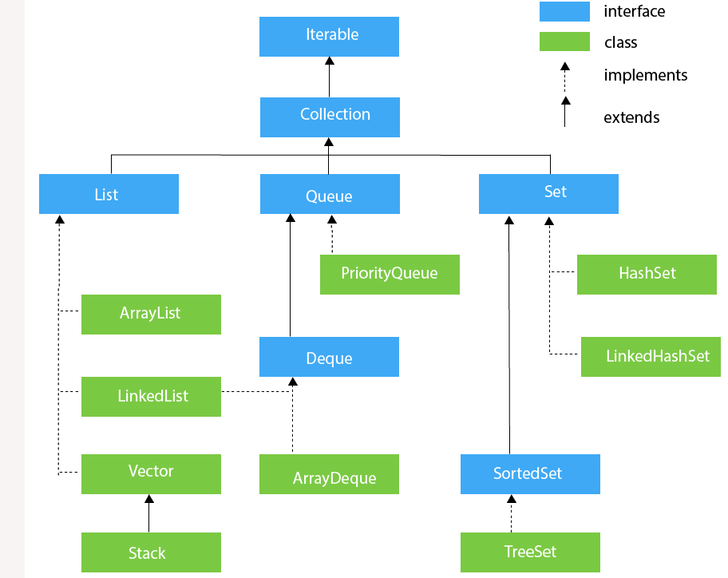

# Collection API

- java.util package에 정의
- Collection : 모든 클래스들의 **Object**를 요소로 저장하는 객체의 최상위 Interface

<br>



- LinkedList : List & Deque
  - List와 Queue를 구현하기에 모두 유용한 구조

<br>

## Set

### HashSet

- 순서 관리 x

- 중복 허용 x : 같은 데이터(equals(), hashCode() 비교시) 는 무시

  - vm은 equals나 hashCode 둘 중 하나라도 다르면 다르다고 생각한다

    ```java
    HashSet<Point> hsPoint = new HashSet<Point>();
    //vm입장에서 equals()나 hashcode 중 하나라도 다르면 Point(1,3)은 서로 다른객체라고 생각
    hsPoint.add(new Point(1,3));
    hsPoint.add(new Point(2,4));
    hsPoint.add(new Point(1,3));
    hsPoint.add(new Point(5,7));
    
    
    //Iterator 사용
    Iterator<Point> itrPoint = hsPoint.iterator();
    while(itrPoint.hasNext()) {
        System.out.println(itrPoint.next());
    }
    ```

    

- sortedset - treeset : set계열 중 순서 관리

<br>

## List

### ArrayList

- 순서 관리
- 중복 허용
- 객체 저장 시 index를 가지고 관리(순서대로)
- 넣은 순서대로 순차적으로 나온다
- descendingIterator() 지원 안함

<br>

### LinkedList

- ArrayList와 유사
- descendingIterator() 지원 => 역순으로 출력

<br>

### Arraylist vs LinkedList

- Arraylist는 내부적으로 index를 가지고 있다.

- 단순증가시에는 상관이 없지만, 삭제시에는 index를 수정하는 추가적인 작업이 필요하다

- 따라서, 삭제 작업이 필요할때는 LinkedList가 훨씬 유리하다

  ```java
  import java.util.ArrayList;
  import java.util.LinkedList;
  import java.util.List;
  
  public class ListPerformanceTest {
  
      public static void main(String[] args) {
          long startTime = System.nanoTime();
  
          List<Point> l = new ArrayList<Point>();
          //List<Point> l = new LinkedList<Point>();
  
          for(int i=0; i<900000; i++) {
              l.add(new Point(i,i));
          }
  
          for(int i=1000; i<50000; i++) {
              l.remove(i);
          }
  
  
          long stopTime = System.nanoTime();
  
          System.out.println(stopTime - startTime);
      }
  
  }
  
  
  => ArrayList : 3724730800
      LinkedList : 2967678700
  ```

  

