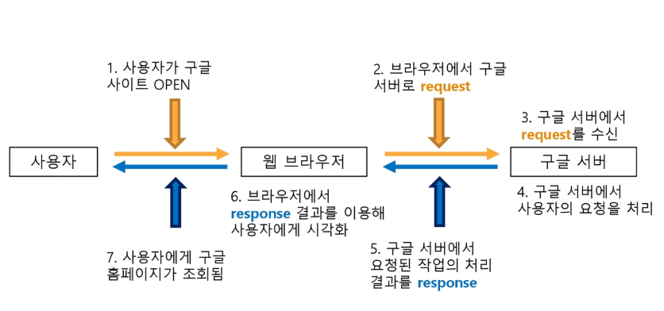
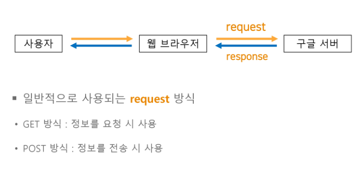
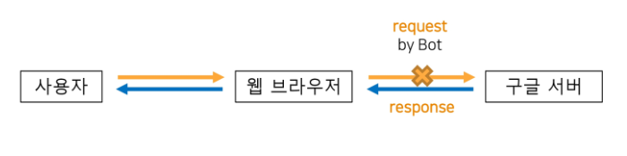

# Crolling

Created By: sooyeon Lee
Last Edited: Jan 13, 2020 10:06 PM
Tags: Crolling, python

<br>

# 웹서비스



<br>

<br>

# 1. Python 패키지 설치

- pip install lxml : html 문서 다루기 위해 필요한 모듈
- pip install bs4 : 문서를 parsing할 때 필요한 모듈
- pip install requests : 서버에 요청을 보낼 때 필요한 모듈
- pip install fake_useragent : 우리가 서버에 request를 보냈을 때 봇으로 오해하고 차단하는 것을 막는 모듈(서버가 사람이 요청을 날렸다고 생각하게끔 header를 만들어주는 역할)

- 우리는 colab을 쓰기 때문에 fake_useragent만 설치

        !pip install fake_useragent

<br>

<br>

<br>

# 2. soup object 객체

- BeautifulSoup : html 파일을 태그 정보를 기준으로 parsing하여 트리 구조의 객체로 생성해주는 라이브러리
- soup객체의 type은 soup이다

1. 파이썬 패키지를 이용한 request
    - **content : 서버에서 response 해준 정보**
    - status_code : request에 대한 서버의 처리 정보(3자리 숫자로 구성)
    - header : response에 대한 부가 정보

    

    ```python
    from bs4 import BeautifulSoup
    import requests
    
    url = "https://www.google.com/"
    
    # 서버의 response 정보를 이용해 response 객체 생성
    response = requests.get(url)
    
    /***********************************************/
    # response 객체에서 html 코드 부분 추출
    data = response.text
    
    # bs4를 이용하여 html코드를 soup객체로 파싱
    soup = BeautifulSoup(data, 'html.parser')
    /***********************************************/
    data = response.content
    soup = BeautifulSoup(data, 'lxml')
    
    # 문서 내에 모든 <a>태그 정보를 찾아 list로 반환
    tags = soup.find_all('a')
    
    # <a> 태그의 href속성 값에서 url 정보 추출
    for tag in tags:
    	# 속성값에 접근하는 2가지 방법
    	# 1. 태그 객체 함수 get()사용
    	print(tag.get('href'))
    	
    	# 2. key값을 이용
	print(tag['href'])
    ```
    <br>
    
2. html 파일 읽기

- prettify() : html 가독성 높여줌

    ```python
    from bs4 import BeautifulSoup
    
    def read_file(fileName):
      file=open(fileName)
      data = file.read()
      file.close()
      return data
    
    html_file = read_file('intro-to-soup-html.html')
    
    # soup object 객체 생성
    soup = BeautifulSoup(html_file, 'lxml')
    
    # soupt prettify
    print(soup.prettify())
    ```


<br>

<br>

<br>

# 3. UserAgent()



- 특정 서버들은 code나 bot이 request하는 것을 막아 둔다
    - 따라서 fake_useragent 라이브러리를 이용해 브라우저가 request하는 것처럼 header정보를 생성해서 request에 같이 날려준다

<br>

- headers는 딕셔너리 타입

        for key,value in response.headers.items():
          print(key,' ',value)

<br>

- UserAgent를 이용한 가짜 header 생성

        import requests
        from fake_useragent import UserAgent
        
        ua = UserAgent()
        
        # header에 chrome타입이라고 명시해라
        header = {'user-agent':ua.chrome}
        
        # 가짜 header를 생성해서 요청보낼 때 같이 보내기
        page = requests.get('https://www.google.com', headers=header)
        
        print(page.content)

<br>

<br>

<br>

# 4. Navigable Strings : 태그 안에 있는 텍스트 정보

- tag.string
- `<title>안녕하세요</title>`

        soup = BeautifulSoup(read_file('intro-to-soup-html.html'),'lxml')
        title = soup.title # <title>태그 객체
        print(title.string)

<br>

<br>

<br>

# 5. 태그 객체 접근 방법

1. 이름을 이용한 태그 객체 접근
    - `p = soup.p`
    - 중복된 이름을 가진 태그는 가장 처음 만난 태그만 출력

    <br>
    
    
    
2. 자식 태그 객체 접근
    - tag.children : 한 레벨 아래의 자식 태그들을  iterator객체로 return
        - type : list_iterator ⇒ 순서가 있는 데이터 타입

            ```python
            body = soup.body
            # list_iterator type - 순서가 있는 데이터 타입
            print(type(body.children)) 
            
            for child in body.children:
              # None이면 아무것도 쓰지말고(' '), 끝에 4줄찍어라(\n\n\n\n)
          print(child if child is not None else '',end='\n\n\n\n')
          ```

    <br>

    - tag.contents : ***서버에서 response해준 정보 content와 다름!!***
      
    - type : list ⇒ 순서가 있는 데이터 타입, list처럼 순서도 있고 loop도 돌릴 수 있음
      
        ```python
        body = soup.body
        print(type(body.contents))
        # list type - list처럼 순서도있고 loop도 돌릴수 있는 타입
        
        for child in body.contents:
            #None이면 아무것도 쓰지말고(' '), 끝에 4줄찍어라(\n\n\n\n)
            print(child if child is not None else '',end='\n\n\n\n')
        ```

    <br>

    - tag.descendants : 전체 자식 태그들을 generator 객체로 return

    - enumerate와 함께 사용

        ```python
        # .contents를 이용한 자식 객체 조회
        children = [child for child in body.contents if child != '\n']
        print(len(children))
        
        # .descendants를 이용한 자식 객체 조회
        # enumerate : 순서를 확인할 수 있는 튜플형식으로 보여줌
        # tag.descendants : 전체 자식 태그들을 generator 객체로 return 
        # 쌍으로 출력
        for index, child in enumerate(soup.body.descendants):
          print(index,'\t', child if child != '\n' else '\\n')
        ```

    

3. 부모 태그 객체 접근

- tag.parent : 한 레벨 위의 부모 태그 객체 조회
- tag.parents : 상위 부모 태그들을 모두 조회

<br>

4. 동일 레벨 객체 접근

- tag.next_sibling : 동일한 레벨에 있는 바로 아래 있는 태그 조회
- tag.next_siblings : 동일한 레벨에 있는 아래 태그 객체들을 list로 return
- tag.previous_sibling : 동일한 레벨에 있는 바로 위에 있는 태그 조회

<br>

5. **find_all() : soup 객체에서 키워드로 태그 정보 조회해서 list로 return**

- 키워드로 태그 정보 조회

    ```python
    soup = BeautifulSoup(read_file('three-sisters.html'),'lxml')
    
    # find_all(name, attrs, recursive, string, limit, **kwargs) - attribute를 이용해 검색
    a_tags = soup.find_all('a')
    print(a_tags)
    ```
    <br>

- 속성을 이용한 태그 검색

    ```python
    # 1.attrs 정보 이용
    attr = {'class':'sister','id':'link1'}
    first_a = soup.find_all('a',attrs=attr)
    print(first_a)
    
    # 2. [속성=값] 형태
    soup.find_all('td', width=200)
    ```
    <br>

- re.compile : Navigable Strings에서 string포함한 정보 찾을 때 쓰면 편리

    ```python
    import re
    
    soup = BeautifulSoup(read_file('three-sisters.html'),'lxml')
    
    # string 정보를 이용해 Navigable Strings 정보를 이용한 검색
    regex = re.compile('Elsie')
    tags = soup.find_all(string=regex)
    print(tags)
    ```
    <br>

- 속성으로 태그 정보 조회

    ```python
    soup = BeautifulSoup(read_file('three-sisters.html'),'lxml')
    
    tags=soup.find_all(class_='story')
    print(tags)
    tags=soup.find_all(id='link1')
    print(tags)
    ```
    <br>

6. find : 검색결과의 첫번째 

    ```python
    soup = BeautifulSoup(read_file('three-sisters.html'),'lxml')
    
    tag = soup.find('a')
    
    # 검색결과의 첫번째 값
    print(tag)
    ```
    
    