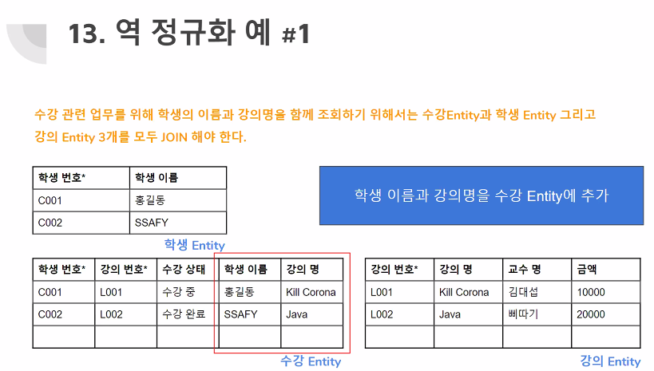

# Modeling

## 1. 데이터 모델링 3단계

 

 

## 2. 데이터 모델링 3요소

 

 

## 3. 정규화

- 데이터 모델링의 과정

- Entity와 Entity 또는 Entity 내 Attribute들 관계를 파악

  => 중복 및 종속성 관련 비효율성 제거

 

### 정규화 - 1차

- 반복되는 속성을 분리하여 별도의 Entity구성

  - 

  - 
  - 

 

### 정규화 - 2차

- 어떤 Entity안에 키가 여러개일때 컬럼들이 모든 키에 종속되어있지 않고, 특정 키에만 종속되어 있을 때
- 기본키중에 특정 컬럼에만 종속된 컬럼**(부분적 종속)이 없어야 한다**

  - 
  - 

 

### 정규화 - 3차

- 주 속성이 아닌 다른 속성에 의존적인 속성은 별도의 Entity 구성
  - 
  - 

 

 

## 4. 역 정규화

- 정규화의 기본 방향은 Entity의 분리
- 업무 성격 상 정규화의 결과로 분리된 Entity들을 조회 시, 많은 JOIN 발생 => 성능 이슈
- 정규화의 기본 방향에 위배되지만,, 성능 문제를 해결하고자 취하는 일련의 작업
- 모든 Entity 대상(X), 조회 업무가 많은 Entity dntjs
- 역 정규화 후, 성능 향상 확인 => 원복도 고려

- 
  - 수강 Entity에는 학생 번호만 있는것이 정규화의 방향이지만 학생 이름과 강의명을 가져올때 JOIN을 매번 해줘야하기 때문에 학생 Entity의 속성으로 넣어줌
- 

 

 

## 5. Master(원장)

- 업무의 핵심 Entity
- 최신 상태 유지
- Master의 변동 사항은 별도의 **이력 Entity(History)** 구성(시점이 중요!)
- 고객 Entity, 계좌 Entity 등
- 많은 JOIN의 기준

 

 

## 6. Transactional(거래)

- **행위 Entity**
- 등록, 삭제만 가능
- 수정 불가 => 카드 거래
  - 삭제하고 다시 등록해줘야함

-------------------------------------------------- 트랜잭션의 전통적인 개념

- 수정 가능 => 주문  

-------------------------------------------------- 최근에는 수정가능한 부분들도 트랜잭션이라고 하는경우 있음

 

 

## 7. History(이력)

- **Master(원장) 변경 사항 관리**
- 수정 가능한 Transactional(거래) 변경 사항 관리
- 등록만 가능, 수정, 삭제 불가 => **LOG성 데이터**
- 주요 분쟁의 근거

 

 

## 8. Transactional with Master Attribute

- Master의 Transactional 시 Master의 특정 속성을 관리
- 휴가 신청 Entity에 사원 Entity의 직급 속성 관리
- 사원 Entity에는 최신의 직급만 관리, 사원 이력 Entity별도 관리

 

 

## 9. DW(DataWarehouse)

- 분석시 사용
- 오랜기간을 통해 추척된 데이터를 하나의 통합 데이터베이스로 구축해 놓은 것을 의미

 

## 10. OLTP vs OLAP

### OLTP

- 여러 과정의 연산이 하나의 단위 프로세스(트랜잭션)로 실행되도록 하는 프로세스

- ex) 계좌이체
  - A 라는 사람이 B 에게 10,000 원을 이체하는 상황
    1. A 라는 사람의 계좌에서 10,000 원이 인출됨
    2. B 라는 사람의 계좌에 10,000 원이 입금됨

- 이 단계는 하나의 프로세스로 이루어져야 하며, 중간에 오류가 발생하는경우 모든 단계를 되돌려야 함

 

### OLAP

- 대용량 데이터를 고속으로 처리하며 쉽고 다양한 관점에서 추출, 분석할 수 있도록 지원하는 데이터 분석 기술

- 데이터를 분석하여, 소비자 패턴, 연령대별의 선호 물품 등을 판별하여 매출에 긍정적 영향을 줄 수 있다

