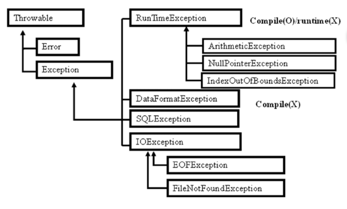
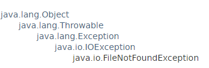

# Exception 

> 

- Java에서 오류는 크게 두 가지
  - Exception : 예외
    - 컴파일러가 체크
    - 예외가 발생하더라도 프로그램을 중단시키지 않고, 복구하여 프로그램을 지속적으로 실행
  - Error : 치명적 오류
    - 컴파일러가 체크하지 않음

<br>

## Checked 

- RuntimeException을 제외한 모든 Exception
  - 컴파일 시에 컴파일러가 체크하여 수정할수 있도록 한다

<br>

## Unchecked

- **RuntimeException**, Error
- sw적으로 복구 불가능하기 떄문에 컴파일러가 체크하지 않음

<br>

### RuntimeException

- 코드 작성이 잘못된 오류로 컴파일시에 체크하지 않고, **실행 시에 오류발생**
- 코드를 수정하면 해결됨
- ArithmeticException, **NullPointException, ArrayIndexOutOfBoundsException**

<br>

<br>

## Exception Handling

ex ) br.readLine() : readLine()은 IOException을 throws하는 메서드

- Exception Handling을 하지 않으면 Compile되지 않는다
- throws 
  - down - top구조
  - 예외 발생할 경우 처리를 호출한 쪽으로 넘긴다

<br>

- try-catch

  - 개발자가 직접 예외 처리

  - 여러 가지 예외가 발생할 경우 catch 블록을 여러 개 정의

  - Exception 클래스들이 상속관계일 경우는 **서브클래스**부터 정의해야 올바르게 구현됨

    - 서브 클래스 먼저 쓰면 에러

      ```java
      public class ExceptionCatchTest {
      
      	public static void main(String[] args) {
      		
      		try {
      			FileInputStream fis = new FileInputStream("hello.txt");
      			
      			BufferedReader br = new BufferedReader(new InputStreamReader(System.in));
      			String str = br.readLine().trim();
                  //에러, 상위클래스 먼저 정의했기 떄문에 에러다
      		}catch (IOException e) {
      			e.printStackTrace();
      		}catch (FileNotFoundException e) {
      			e.printStackTrace();
      		}	
      	}
      }
      ```

      <br>

    > 

  <br>

  - 예외가 발생할 코드가 없는데 catch 블록이 있을경우, 컴파일 에러
  - catch : 예외발생시에만 수행
  - finally : 예외발생 여부와 관계없이 마지막으로 꼭 수행해야 할 문장
    - 주로 stream을 닫거나, 마무리하는 코드를 작성

  - e.printStackTrace()
    - 별도의 thread가 출력하기 때문에 출력시점이 다를수있다.

<br>

- 예외를 어느상황에서 어떻게 처리할지가 중요!

<br>

### 상속관계에 있는 클래스의  Exception handling

Exception handling 처리시에 Overriding되는 메서드라면 throws는

- Super 클래스의 메서드가 throws 하고 있는 것을 그대로 throws할 수 있다
- Super 클래스의 메서드가 throws 하고 있는 것의 Sub Exception 클래스를 throws할 수 있다
- Sub 클래스의 메서드에서 필요없다면 throws를 기술하지 않아도 된다

<br>

## Customize Exception

- VM이 발생하지 않은 예외를 개발자가 직접 예외를 발생시킬 수 잇다

- 개발자가 직접 필요한 Exception 클래스를 객체 생성

- CustomException - Exception을 상속받아 만든 예외 클래스

  ```java
  //예외 클래스
  public class CustomException extends Exception{
  
      //클래스이름에 warning뜰떄 자동으로 만들어줌
      private static final long serialVersionUID = 3438429829254678688L;
  
  
      public CustomException() {
          super("사용자 지정 예외입니다");
      }
  
      public void showDetails() {
          System.out.println("사용자 지정 예외의 상세한 내용입니다");
      }
  }
  ```

<br>

- CustomExceptionUse - 비즈니스 로직을 수행하는 클래스

  ```java
  //비즈니스 로직을 수행하는 클래스
  public class CustomExceptionUse {
      public void m(int value) throws CustomException{
          if(value < 0) throw new CustomException();
      }
  }
  ```

<br>

- CustomExceptionTest 

  ```java
  //런타임시 사용되게 됨
  public class CustomExceptionTest {
  
      public static void main(String[] args) {
          CustomExceptionUse ceu = new CustomExceptionUse();
          try {
              ceu.m(-10); 	//에러발생
          } catch (CustomException e) {
              e.showDetails();
              e.printStackTrace();
          }
      }
  }
  
  => 사용자 지정 예외의 상세한 내용입니다
  chap8.base.CustomException: 사용자 지정 예외입니다
  	at chap8.base.CustomExceptionUse.m(CustomExceptionUse.java:5)
  	at chap8.base.CustomExceptionTest.main(CustomExceptionTest.java:8)
  
  ```

  

