# 1. Git 특징

- 완벽한 분산 구조

  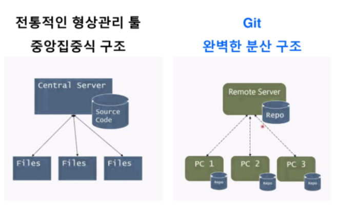

<br>

- 데이터를 변경사항으로 기록하지 않고 스냅샷으로 기록한다

<br>

<br>

<br>

# 2. Git 용어

> 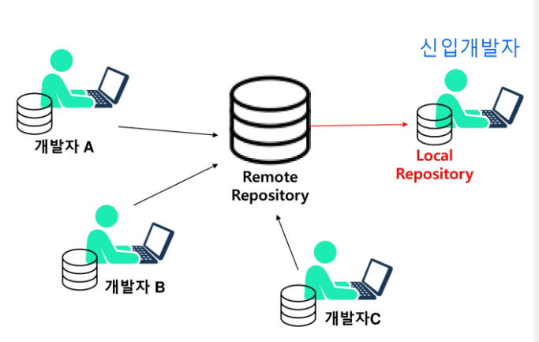

<br>

- 원격 저장소(Remote Repository) - 원본 소스 저장소
- 로컬 저장소(Local Repository)
  - 작업 디렉토리
  - 스테이징 영역
  - 로컬 저장소

<br>

- 커밋(Commit)
  - Git에서 가장 의미있는 변경의 단위(개발자마다 조직마다 다르다)
  - 소스내용에 라벨링 하는 과정
  - 커밋하다
    - 변경점을 로컬 저장소로 저장하는 과정

<br>

- Clone - 원격저장소의 소스코드를 로컬저장소에 복사하는 과정
  - git clone

<br>

<br>

### 로컬 저장소

> 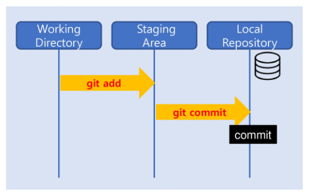

<br>

- 작업 디렉토리 
  - 현재 작업중에 있는 디렉토리
  - Git에서 관리는 하지만, 추적은 하지 않음

<br>

- 스테이징 영역
  - 작업한 내용이 올라가는 임시 저장 영역
  - Git이 추적 관리하는 영역
  - **커밋을 준비하는 영역**

<br>

- 로컬 저장소

  - **커밋들이 영구적으로 저장되는 영역**
  - 원격저장소로부터 clone한 커밋들이 존재하는 영역

  


<br>

<br>

<br>

# 3. Git Flow

> 작업 디렉토리에서 작업한 내용을 스테이지 영역에 추가해서(add), 의미있는 변경점이 쌓이면 최종적으로는 커밋을 만들어(commit) 로컬 저장소에 영구적으로 저장한다

<br>

### Flow

<br>

> 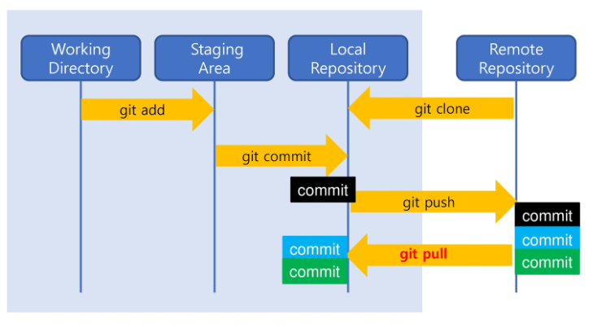


<br>

<br>

### Clone

- remote repository의 저장소를 로컬에 복사한다 => 로컬 저장소 생성

  > 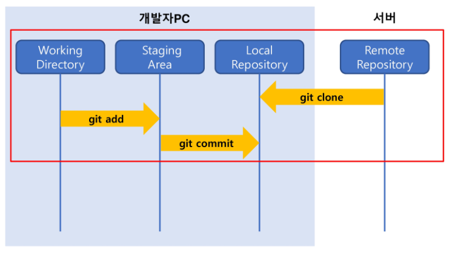

<br>

<br>

### Push

- 로컬저장소에서 만든 커밋을 원격저장소로 업로드

  > 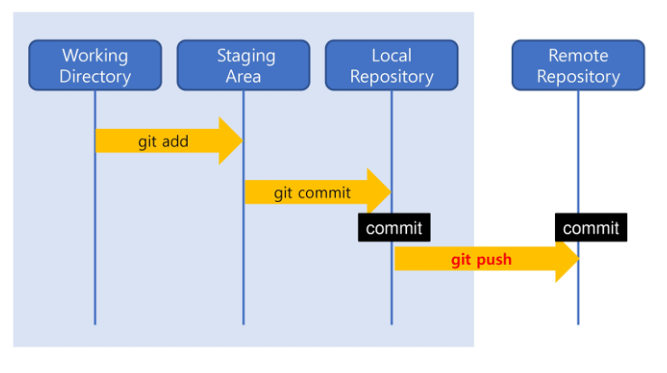


<br>

<br>

### Pull

- 원격저장소에 있는 다른 개발자의 커밋들을 받아온다

  > 


<br>

<br>

<br>

# 4. Gitlab 

### 1. Gitlab 원격 저장소 생성

### 2. Git bash 실행

### 3. 기본 환경 설정

- 사용자의 이름, 이메일 기본 설정으로 등록

  ```bash
  $ git config --global user.name
  $ git config --global user.name "Sooyeon Lee"
  ```

<br>

- 기본 에디터를 vim으로 기본 설정

  ```bash
  $ git config --global core.editor vim
  ```

<br>

- 설정 값 확인

  ```bash
  $ git config --global --list
  ```

<br>

- 기본 설정 값 변경 & 종료

  ```bash
  $ vi ~/.gitconfig
  
  :wq
  ```

<br>

- gittest라는 폴더를 기본 폴더로 설정

  ```bash
  $ mkdir ~/gittest
  ```

<br>

<br>

### 4. 새 로컬저장소 생성

- 기본폴더 gittest에 새 로컬저장소 my_project 생성

  ```bash
  $ cd ~/gittest     				// gittest로 이동
  $ mkdir my_project				// 새 로컬저장소 생성
  $ cd my_project
  $ ls -la						// 디렉토리 뭐있는지 확인
  ```

<br>

<Br>

### 5. 로컬저장소 초기화

- 새로 만든 my_project를 git 로컬저장소로 초기화한다

  ```bash
  $ git init
  Initialized empty Git repository in C:/Users/multicampus/gittest/my_project/.git/
  
  multicampus@M702 MINGW64 ~/gittest/my_project (master)
  $ ls -la
  
  => 
  drwxr-xr-x 1 multicampus 197121 0  1월 17 11:24 ./
  drwxr-xr-x 1 multicampus 197121 0  1월 17 11:22 ../
  drwxr-xr-x 1 multicampus 197121 0  1월 17 11:24 .git/	
  
  ```

  <br>

  - master라는 기본 브랜치가 생성되고 핵심 폴더인 `.git` 이 생성됨
  - **Git은 `.git` 이 있어야 해당 폴더 내부에서 변경되는 파일들에 대해 추적/관리를 시작할 수 있다**


<br>

<br>

### 6. 상태 확인 기본 명령어

- 현재 폴더 내 파일의 상태 확인

  ```bash
  $ git status
  ```

  <br>

- 커밋의 히스토리 확인

  ```bash
  $ git log
  ```

<br>

<br>

### 7. 원격저장소와 연결하기

- gitlab에서 원격저장소의 주소를 제공

- '저장소 별칭'은 저장소 주소를 쉽게 접근하기 위한 일종의 변수(default = origin)

  ```bash
  $ git remote add [저장소 별칭][저장소 주소]
  $ git remote add origin https://lab.ssafy.com/qkdqnwpwp/gitlab_sooy.git
  ```

<br>

- 현재 등록된 원격저장소의 상세 정보 확인

  ```bash
  $ git remote -v
  ```

<br>

- 저장소별칭 바꾸기

  ```bash
  $ git remote rename [변경전][변경후]
  ```

<br>

<br>

### 8. 새 파일 생성 및 저장

- vim으로 새 파일 생성

  - vi 명령어는 이미 존재하는 파일이면 파일을 open하고, 없는 파일이면 생성 후 해당 파일을 open

  ```bash
  $ vi TestService.java
  ```

<br>

- i 입력하면 입력 모드

<br>

<br>

### 9. 작업 디렉토리에서의 파일 상태

- Untracked

  - Git에 의해 관리되지 않는 파일

  - 단 한번도 Staging Area에 포함되지 않은 파일

    => `add`를 하지 않은 파일

<br>

- Tracked

  - Git에 의해 관리되는 파일

  - 한 번 이상 Staging Area에 포함된 파일

    => `add`해준 파일

<br>

- `add` 시 다음 Warning로그가 발생한경우

  ```bash
  warning: LF will be replaced by CRLF in TestService.java.
  The file will have its original line endings in your working directory
  ```

  - 경고 메시지 설정을 off

    ```bash
    $ git config --global core.safecrlf false
    ```


<br>

<br>

### 10. 커밋

- 에디터 실행 없이 인라인으로 커밋

  ```bash
  $ git commit -m "커밋메시지"
  ```

<br>

- 커밋 히스토리 확인

  ```bash
  $ git log
  ```

<br>

<br>

### 11. 파일 수정

- 파일 수정

  ```bash
  $ vi TestService.java
  
  i						// 입력 모드
  [Esc] + :wq + [Enter] 	//저장하고 에디터 종료
  ```

<br>

<br>

### 12. 변경된 코드 확인

- 작업 디렉토리에서 기존 코드 대비 어떤 코드가 변경되었는지 보여줌

  ```bash
  $ git diff
  ```

<br>

- 현재 `add`를 안했으므로 TestService.java는 현재 스테이징 영역에 있는 상태는 아니지만, 한 번 이상 추적을 시작한 파일이므로 Git에 의해 관리되는 파일이기에 현재 `modified` 상태임을 알 수 있다

  > 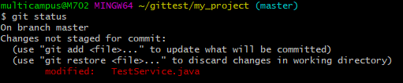

<br>

- 변경 파일을 `add` 로 스테이징 영역에 추가하면 다음과 같이 초록색으로 바뀐다

  > 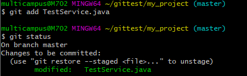


<br>

<br>

### 13. git log 명령어의 옵션들

- 모든 커밋의 변경점 함께 출력 : 삭제되거나 추가한 변경점들을 보여준다

  ```bash
  $ git log -u
  ```

<br>

- 특정 한 개 커밋의 변경점 출력

  ```bash
  $ git log -u '커밋ID'
  ```

<br>

- 최신 커밋순으로 1개 커밋만 출력

  ```bash
  $ git log -1
  ```

<br>

- 커밋(메시지)과 해당 커밋이 수정한 파일들 함께 출력

  ```bash
  $ git log --name-only
  ```

<br>

- 커밋을 한 줄로 요약해서 출력

  ```bash
  $ git log --oneline
  ```

<br>

- 특정 커밋의 내용이 보고싶으면, 해당 커밋의 커밋ID를 알아야 한다. 처음에 반영한 커밋을 확인할 수 있음

  ```bash
  $ git show '커밋ID'
  ```

<br>

- 마지막으로 반영한 최신 커밋 메시지 변경

  ```bash
  $ git commit --amend
  ```

  

<br>

<br>

### 14. 코드 원복

- 코드 원복

  = 반영한 특정 코드(변경점)을 제거한다

  = 변경을 취소한다

  = 반영한 커밋을 되돌린다

  = 반영한 커밋을 **revert** 시킨다

<br>

- **Git의 원복 단위는 커밋**

- 지정한 커밋에 대해 **Revert커밋**이 자동으로 생성된다(직전 커밋만 가능!)

  - push 후에도 가능 - 대신 revert커밋 기록이 남는다
  - commit까지 한 상태에서 revert 대신 reset사용하면 커밋기록도 사라짐

  - 옵션 추가하면 다른 커밋도 가능

  ```bash
  $ git revert 'commit ID'	// 가장 최근의 커밋의 파일을 바꿀것이기 때문에 가장 최근의 커밋 아이디를 입력해준다
  ```

<br>

- git log로 코드 원복됐는지 확인

- 파일을 단순히 읽어 출력해주는 명령어

  ```bash
  $ cat TestService.java
  ```

<br>

<br>

<br>

# 5. Git Branch

- Feature Branch : 나중에 main branch 가 될 확률이 높은 branch

- 생성, git 초기화

  ```bash
  $ cd ~/gittest
  $ mkdir branch_test
  $ cd branch_test
  $ git init
  ```

<br>

- 현재 작업중인 브랜치 확인하는 명령어

  ```bash
  $ git branch	// master 브랜치는 첫 번재 커밋을 만들어야 생성 커밋을 가리킬 수 있음
  ```

  <br>

### HEAD

- 현재 브랜치를 가리키는 일종의 포인터

- 현재 브랜치의 마지막 커밋에 대한 스냅샷

<br>

- 첫번째 commit 만들기

- 새 브랜치 생성

  ```bash
  $ git branch feature-login 	// 생성할 브랜치명
  ```

<br>

- 브랜치 이동

  ```bash
  $ git checkout feature-login
  ```

<br>

- 이동한 브랜치에서 커밋하면 새로운 브랜치에서 커밋된 것
  - master 브랜치에는 반영안됨
  - 브랜치에 연결된 파일들만 보인다

<br>

- 모든 커밋 로그 확인

  ```bash
  $ git log --all --graph
  ```

  <br>

  > 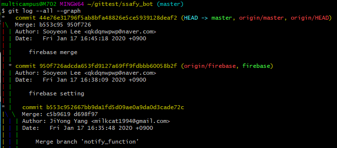

<br>

<br>

<br>

## 6. 개발 중 이슈가 발생

- master 브랜치에서 새로운 브랜치 생성

  ```bash
  $ git branch
  ```

<br>

- 브랜치 생성과 동시에 이동(checkout) - 만들면서 브랜치 갈아타기

  ```bash
  $ git checkout -b issue
  ```

<br>

- 기존파일 MainService.java 변경

  ```bash
  $ vi MainService.java
  ```

<br>

- 파일 스테이징 영역에 올리고 커밋

  ```bash
  $ git add MainService.java
  $ git commit -m "Commit 5 for issue number-1"
  ```

  <br>

  > 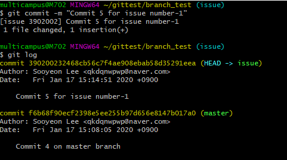

<br>

- 현재 상태

  > 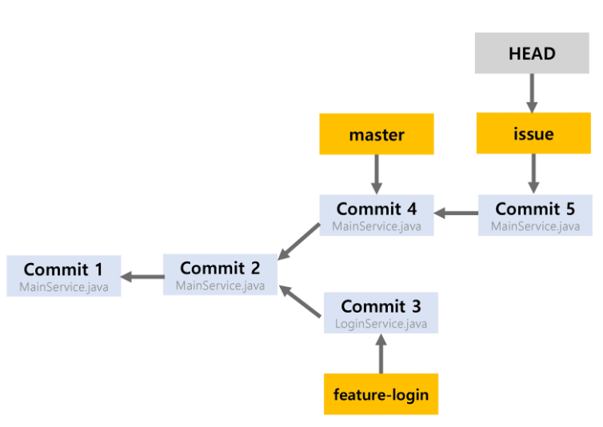

<br>

- 이슈 해결이 완료되면 merge(병합해줘야 한다)

  > 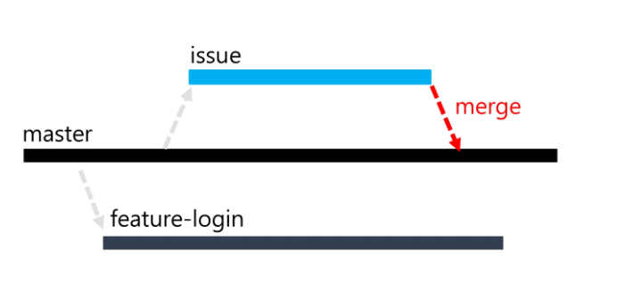

<br>

<br>

<br>

# 7. Merge(브랜치 병합)

- 브랜치 병합(merge)

  - 기준이 되는 브랜치로 이동해서 병합

  - master 브랜치로 이동

    ```bash
    $ git checkout master
    ```

    <br>

  - 합쳐질 브랜치(issue) 를 merge

    ```bash
    $ git merge issue
    ```

  - HEAD가 master를 가리키게 된다.

<br>

- 더 이상 사용하지 않는 브랜치 삭제하기

  ```bash
  $ git branch -d issue
  ```

<br>

- master브랜치에 feature-login 브랜치도 병합하기

  ```bash
  $ git branch				// 현재 브랜치가 mastser인지 확인
  $ git merge feature-login	// master브랜치에 feature-login 브랜치 병합
  ```

  <br>

  > 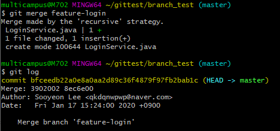

  - **merge하면 위와 같이 커밋이 자동으로 생성된다!**

<br>

- merge후에는 커밋이 자동으로 생성되었으므로 push 만 해주면 된다

<br>

- 모든 브랜치 병합 결과

  > 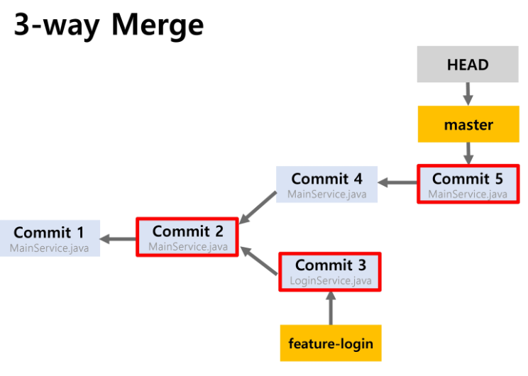

<br>

- 사용하지 않는 브랜치 삭제

  ```bash
  $ git branch -d issue	// 삭제할 브랜치명
  ```

<br>

<br>

<br>

# 8. 3-way Merge

- 공통 부모 커밋과 각 브랜치의 최신 커밋을 모두 고려하여 병합하는 방식으로, 3-way Merge의 결과는 새로운 커밋으로 생성됨
- 하지만 다른 branch에서 똑같은 파일을 변경한다면 conflict가 일어날 수 있다

<br>

### 1. Conflict 해결

- 직접 merge하기

  ```bash
  $ vi MainService.java
  ```

  <br>

  > 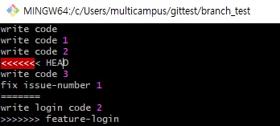

<br>

- mergetool 사용하기

  ```bash
  $ git mergetool
  vimdiff 입력
  ```

  - Conflict 기호 제거(<<<<<<,=======,>>>>>>>)
  - 수정완료되면 저장 후 종료
  - 나머지 3-way 창은 수정 없이 종료 ([ESC] + :q)

<br>

- 병합 제대로 되었는지 확인 후, commit 생성

  ```bash
  $ vi MainService.java
  $ git add MainService.java
  $ git commit -m "Merge Commit2"
  ```

<br>

- 로그 확인하면 Merge branch 를 확인 할 수 있다

  ```bash
  $ git log --oneline
  ```

  <br>

  > 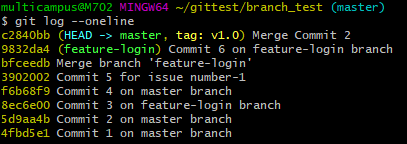

  

<br>

<br>

<br>

# 9. 태그

- 태그는 특정 시점의 소스코드 정보를 기록
- 개발 도중 의미있는 시점의 커밋을 태깅한 것
  - 중요한 이슈 해결
  - 1차 목표 기능 개발 완료

<br>

- 태그 종류

  - Lightweight 태그

    - 버전명과 같은 태그명만 남기는 태그

      ```bash
      $ git tag [태그명]
      ```

      

  <br>

  - Annotated 태그

    - Git 데이터베이스에 태그를 만든 사람의 이름, 이메일, 태그 생성 날짜, 태그 메시지 등을 저장한 태그

      ```bash
      $ git tag -a [태그명] -m [태그 메시지]
      $ git tag -a v1.0 -m "Implemented login feature"
      ```

<br>

- 태그 정보 확인

  ```bash
  $ git show v1.0
  ```

  <br>

  > 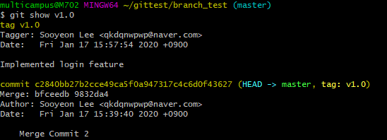

<br>

- 특정 시점의 커밋 태그하기

  - 태깅하고자 하는 커밋의 ID값 확인

    ```bash
    $ git log --oneline
    $ git tag -a v0.1 [커밋ID] -m "fix issue number-1"
    ```

  <br>

  - 태그 정보 확인

    ```bash
    $ git show v0.1
    ```