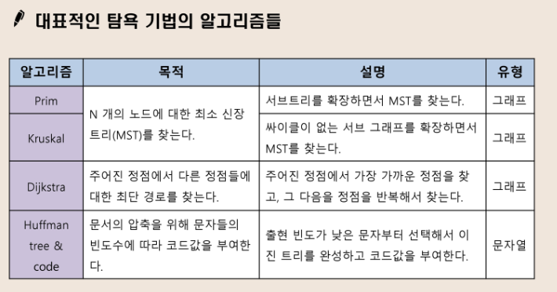

# Greedy

- 선택시마다 그 순간에 최적이라고 생각되는 것을 선택해 나가는 방식

- 한번 선택한 것은 번복하지 않는다.

- 각 선택 시점에서 이루어지는 결정은 지역적으로는 최적이지만, 그 선택들을 계속 수집하여 최종적인 해답을 만들었다고 해서, **그것이 최적이라는 보장은 없다**

  => 하지만 시간적으로는 거의 최고

<br>

## 탐욕알고리즘의 동작 과정

```markdo
1. 해 선택
- 현재 상태에서 부분 문제의 최적 해를 구한 뒤, 이를 부분해 집합에 추가한다

2. 실행 가능성 검사
- 문제의 제약 조건을 위반하지 않는지 검사

3. 해 검사
- 새로운 부분해 집합이 문제의 해가 되는지 확인
- 아직 전체 문제의 해가 완성되지 않았다면 1의 해 선택부터 다시 시작한다
```

<br>

<br>

## Knapsack 문제 유형

- 0-1 Knapsack
  - 물건을 쪼갤 수 없는 경우
  - 최적해를 구하기 어렵다(반례가 많다)

<br>

- Fractional Knapsack
  - 물건을 쪼갤 수 있는 경우
  - 단위당 높은 가치 순으로 부분합을 구할 수 있다

<br>

<br>

## 활동 선택 문제

- 시작시간과 종료시간이 있는 n개 활동집합에서 서로 겹치지 않는 최대갯수의 활동들의 집합을 구하는 문제
- **종료 시간**이 가장 빠른 활동을 선택을 하는게 유리한 선택
  - 시간이 겹칠수는 있으나, 종료 시간이 가장 빨리 끝나므로 다른 활동도 할수있다
  - 종료시간순으로 정렬

<br>

<br>

## 대표적인 탐욕 기법의 알고리즘들

> 

<br>

- Kruskal 

  - 싸이클이 없는 간선 찾기

    => 간선의 정점을 합쳐나가는 방식

    => 싸이클 판단여부? : Union 실패하면 같은 집합

  - Dijkstra : 가중치가 있는 그래프에서의 최단경로

    - 비용이 음수가 될수는 없음

  - BFS : 가중치가 없는 그래프에서의 최단경로