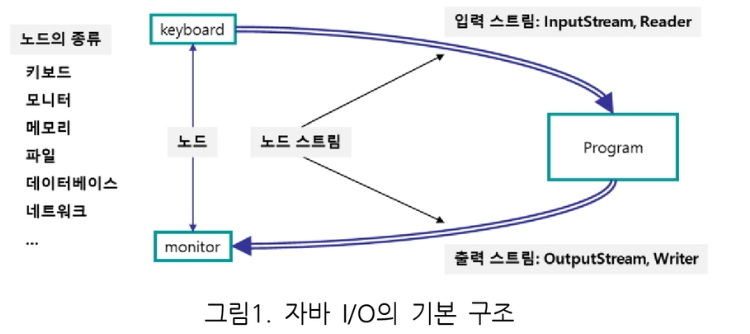
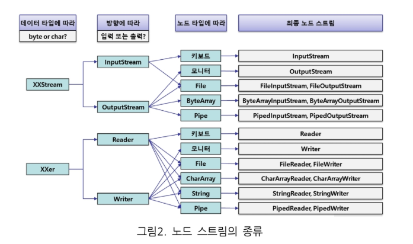

# IO(p21~)

- 노드(node)

  - 데이터의 소스나 목적지

- 스트림(Stream)

  - 데이터의 소스에서 목적지까지 데이터를 이동시키는 일종의 통로

  > 

<br>

- 스트림을 통해서 전송되는 데이터는 기본적으로 바이트(byte = 8bits)

  - 한글과 같은 문자들은 바이트로 처리되기 어렵다 => 문자 데이터를 처리할 수 있다(받는건 바이트로)

  - stream - 바이트처리

  - reader, writer -  문자처리

    > 

<br>

### 처리방법

- input, output 나눠서 처리
- 문자 또는 비문자(byte)로 처리할지
- 자원반납(close)

<br>

<br>

## File

- File.separator

  - 운영체제마다 경로 표현이 다른데 경로를 알아서 구분시켜주는 File의 메서드

    ```java
    String dirName = "c:"+File.separator + "files" + File.separator + "mydir";
    ```

- URL vs URI

  - URL : 보통 어느서버에 어느경로(location)
  - URI : 자원, 대상 그 자체

- file.deleteOnExit() : 프로그램 종료시 파일 사라짐

- FileTest

  ```java
  public class FileTest {
  
      public static void main(String[] args) throws IOException, URISyntaxException {	
          String dirName = "c:"+File.separator + "files" + File.separator + "mydir";
          File file1 = new File(dirName);
          file1.mkdir();	//files 디렉토리에 mydir라는 새로운 디렉토리 만들어짐
  
          File file2 = new File(dirName, "test2.txt");
          file2.createNewFile();	//mydir에 test2.txt 생성
  
          File file4 = new File(new URI("file:///C:/files/mydir/test4.txt"));
          file4.createNewFile();
  
          //url : 어느서버에 어느경로(location)
          //uri : 대상 그 자체
  
          //특별한 처리 없으면 실행할떄마다 파일 새로 생성됨
          file4.deleteOnExit();	// 프로그램 종료시 파일 사라짐
      }
  }
  ```

<br>

- UseFileTest

  ```java
  public class UseFileTest {
  
      public static void main(String[] args) {
          File currentDir = new File(".");	//'.'은 현재 폴더를 의미
          System.out.println(currentDir.getAbsolutePath());
  
          if(currentDir.exists()) {
              File[] childs = currentDir.listFiles();
  
              for(File child : childs) {
                  Date time = new Date(child.lastModified());
                  String name = child.getName();
                  long length = child.length();
  
                  if(child.isDirectory()) {	//폴더이면
                      name = "[" + child.getName() + "]";
                  }
  
                  //.test 아래에 있는 파일들 출력
                  System.out.printf("%-20s\t%tF %<tT\t%s%n", name, time, length);
              }
          }
      }
  }
  
  
  => C:\SSAFY\01_java\test\.
  .classpath          	2020-02-17 12:01:38	465
  .project            	2020-01-28 12:46:51	380
  [.settings]         	2020-01-28 12:46:51	0
  [bin]               	2020-02-18 16:22:10	4096
  [doc]               	2020-02-04 10:30:31	4096
  Solution11.txt      	2020-01-28 12:51:02	320
  Solution21.txt      	2020-01-28 14:36:03	130
  Solution22.txt      	2020-01-28 14:34:57	129
  Solution42.txt      	2020-01-28 15:42:15	136
  [src]               	2020-02-18 16:22:10	4096
  
  ```

<br>

### 파일 복사(File)

```java
public class FileCopyTest {

    public static void main(String[] args) {
        File src = new File("c:"+File.separator+"files"+File.separator+"interesting.jpg");
        File tgt = new File("c:"+File.separator+"files"+File.separator+"TEMP"+File.separator+"interesting.jpg");


        try {
            FileInputStream input = new FileInputStream(src);
            FileOutputStream output = new FileOutputStream(tgt);

            byte[] buffer = new byte[100];

            int read = 0;
            //buffer의 사이즈만큼 읽어옴
            while((read = input.read(buffer)) > 0) {
                output.write(buffer, 0, read);
            }
        }catch (Exception e) {
            e.printStackTrace();
        }
    }
}
```

<br>

### 파일 읽기(한글은 UTF-8 로 인코딩)

```java
public class FileInputStreamTest {

    public static void main(String[] args) throws IOException {
        FileInputStream fis = new FileInputStream("c:\\files\\hello.txt");
        InputStreamReader isr = new InputStreamReader(fis, "UTF-8"); //인코딩

        int i = 0;
        while((i = isr.read()) != -1) {
            char c = (char) i;
            System.out.print(c);
        }
        fis.close();
    }
}
```

<br>

### 텍스트파일 복사

```java
public class FileAppendTest {
    public static void main(String[] args) {
        File src = new File("c:"+File.separator+"files"+File.separator+"hello.txt");
        File tgt = new File("c:"+File.separator+"files"+File.separator+"TEMP"+File.separator+"hello.txt");

        FileInputStream input = null;
        FileOutputStream output = null;

        try {
            input = new FileInputStream(src);
            if(tgt.exists()) {	//타겟파일이 있으면
                System.out.println("tgt File exist");
                output = new FileOutputStream(tgt, true);	//있으면 append하고
            }else {
                output = new FileOutputStream(tgt);	//없으면 새로 만들기
            }

            byte[] buffer = new byte[100];
            int read = 0;
            while((read = input.read(buffer)) > 0) {
                output.write(buffer, 0, read);
            }

        }catch (Exception e) {
            e.printStackTrace();
        }finally {
            try {
                input.close();
                output.close();
            } catch (Exception e) {
                e.printStackTrace();
            }
        }
    }
}
```

