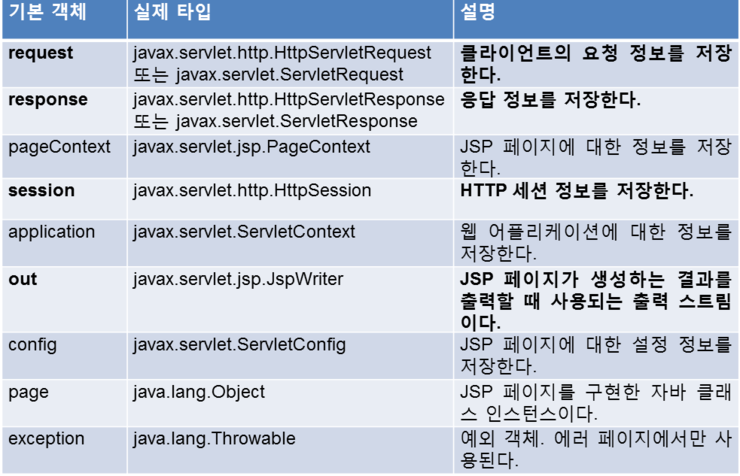
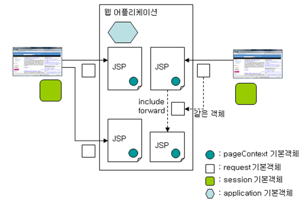
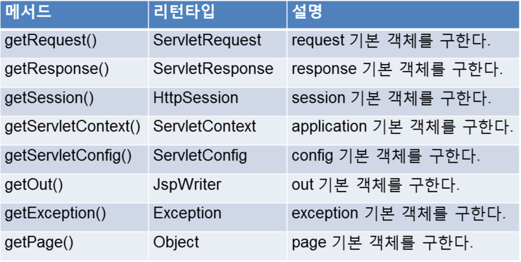
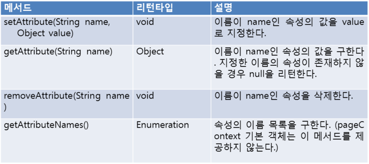

## servlet vs jsp

### servlet

- html in java : java코드내에서 html을 작성해줘야함

<br>

### jsp

- java in html : html 내에서 ?로 값을 전달해줄수있음

- jsp 스크립팅 요소 - 표현식
  - 데이터를 브라우저에 출력할 때 사용 (서버에서 클라이언트에 데이터를 넘겨줄 때 사용)

- 지시자

  

## 서버

- tomcat(서버)를 직접 바꾸면 위험하니, 이클립스의 `.metadata`에서 테스트서버를 만들어서 사용한다

- 그래서 tomcat과 구조가 비슷함

  

<br>

<br>

# JSP

## page 지시문

```java
<%@ page language="java" contentType="text/html; charset=UTF-8"
    pageEncoding="UTF-8"%>
```

<br><br>

## jsp  기본객체

- exception 객체는 에러 페이지에서만 사용 가능!



<br>

### 기본객체 영역

- Page 영역 : 하나의 JSP페이지를 처리할 때 사용되는 영역

- Request 영역 : 하나의 HTTP요청을 처리할 때 사용되는 영역

- Session 영역 : 하나의 웹브라우저와 관련된 영역

- Application 영역 : 하나의 웹어플리케이션과 관련된 영역

  

<br>

### pageContext

- 해당 페이지에 속하는 다른 기본객체에 대한 접근 메소드를 제공

  

<br>

### 공통 method

- servlet과 jsp페이지 간에 특정 정보를 주고 받거나 공유 하기 위한 메소드를 지원

  

<br>

<br>

### WEB Page 이동

- sendRedirect : 단순 페이지 이동, 정확한 위치를 명시해 주어야함, request에 있는걸 다 버리고 이동
- forward : application 내에서 이동, 객체가 request와 response를 가지고 그대로 전달

|              | forward(request, response)                                   | sendRedirect(location)                                       |
| :----------: | :----------------------------------------------------------- | ------------------------------------------------------------ |
|   사용방법   | RequestDispatcher dispatcher = request.getRequestDispatcher(path); dispatcher.forward(request, response); | response.sendRedirect(location);                             |
|   이동범위   | **동일 서버내 경로(동일 application 내에서 이동)**           | **동일 서버 포함, 타 URL 가능**                              |
| location bar | 기존 URL 유지(실제 이동되는 주소 확인 불가)                  | 이동하는 page로 변경                                         |
|     객체     | **기존의 request와 response가 그대로 전달**                  | **기존의 requst와 response는 소멸되고, 새로운 request와 response가 생성.** |
|     속도     | 비교적 빠름                                                  | forward()에 비해 느림                                        |
| 데이터 유지  | **request의 setAttribute(name, value)를 통해 전달**          | **request로는 저장 불가능. session이나 cookie를 이용**       |

<br>

<br>

### getContextPath() vs getContextURI()

- request.getContextPath() : 프로젝트 path만 얻어온다

  - home(index page)으로 이동시 사용

  - http://localhost/servlet/test.jsp 의 경우

    => /servlet 경로만 얻어옴

<br>

- request.getContextURI() : 프로젝트와 파일 경로까지 얻어옴

  - http://localhost/servlet/test.jsp의 경우

    => /servlet/test.jsp 까지 얻어옴