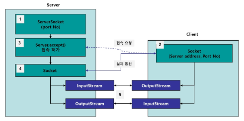

# Java Network

## 1. Network 개요

- IP : 패킷 통신 방식의 인터넷 프로토콜
- HTTP 
  - 인터넷 상에서의 통신 프로토콜
- Port 
  - 해당 프로그램에서(os레벨) 프로그램이 가지는 고유의 번호
- Socket
  - port와 관련
  - 입력과 출력의 양 끝단을 노드라고 하는데, 네트워크 프로그래밍에서의 노드를 소켓이라고 함
  - 소켓에서 각각 InputStream과 OutputStream을 생성해서 통신하게 된다

 

 

## 2. TCP/IP

### TCP

- 두 노드가 1:1로 연결 후 신뢰성 있는 통신을 함
- 신뢰성이 있다
  - 데이터의 전송 순서가 보장됨
  - 데이터의 수신 여부가 확인됨
  - 제대로 전송되지 않으면 계속 요청과 응답을 반복
  - UDP보다 느림

 

### UDP

- 노드간 연결이 없고, 서버는 언제나 데이터를 보내며 관심있는 클라이언트만 데이터를 수신하는 구조
- 1:1, n:n 등 다양한 접속 형태 가능

- 어느정도의 data loss를 감수
- 통신속도 빠름

 

 

## 3. TCP를 이용한 네트워크 프로그램

1. 서버는 특정 포트에서 ServerSocket이 클라이언트의 접속을 기다린다. 

   서버 소켓은 n명의 사용자로부터 접속 요청을 받을 수 있다.

2. 클라이언트는 서버의 아이피와 포트를 이용해 Socket 객체를 생성하고 서버로 접속을 요청한다.

3. 서버는 `accept()`를 통해 클라이언트의 접속을 허용하고, 이때 `accept()`의 리턴값으로 Socket객체가 생성된다

   => 만들어진 소켓은 앞으로 클라이언트와 1:1 통신을 담당

4. 클라이언트의 소켓과 서버의 소켓을 노드로 하는 InputStream과  OutputStream이 각각 생성되서 통신한다.

5. 