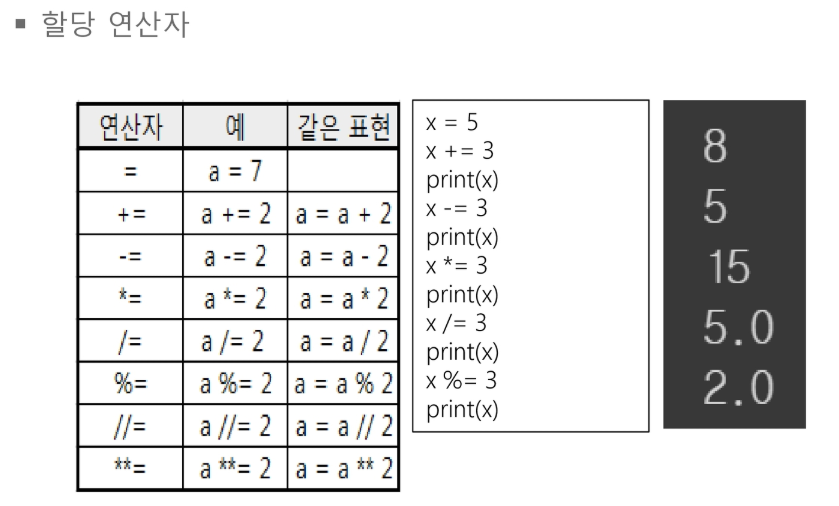

# Python기초

Created By: sooyeon Lee
Last Edited: Jan 13, 2020 10:06 PM
Tags: basic, Python

- google colab 사용

<br>

# 1. Data Type

- 숫자형 : int, float, complex
    - 정수형은 길이에 제한이 없다
    - complex는 복소수 : images에서는 j로 표시(수학에서는 i)
- type() : 데이터 타입 확인
- 형변환시 : int(n), float(n), complex(n) 형태로 사용
    - int(실수)일때 반올림 안해줌
- 연산결과는 float형태로 return

<br>

<br>

<br>

# 2. 연산자




<br>

<br>

<br>

# 3. 문자열

- title() : 형식을 갖춰서 출력


- str() : 문자형 데이터 타입으로 변환

<br>

<br>

### 문자열 포맷

- 문자열에 숫자 또는 문자열을 대입

1. % 연산자
- 값 여러개 있을 때는 ( ) 사용


2. format()

- 인자 순서를 결정할 수 있음


<br>

<br>

### 문자열 인덱싱(Indexing)

- 문자열은 배열 : 인덱스로 각 문자에 접근 가능
- 하지만, 각 슬롯에 저장된 값을 재할당 하는 것은 불가하다

<br>

<br>

### 문자열 슬라이싱(Slicing)

- [a:b] ⇒ a이상 b미만


<br>

<br>

### 문자열 함수들

- len() : 문자열 길이
    - len(str)

<br>

- replace(a,b) : 문자열 교체
    - a를 b로 교체

<br>

- upper(), lower() : 문자열 대/소문자 변환
    - str.upper()

<br>

- split() : 문자열 나누기
    - list형태로 반환


<br>

- strip(), rstrip(), lstrip() : 문자열 공백 없애기
    - str.strip()

<br>

- in, not in : 문자열 체크

    

<br>

- ''' : 여러 줄을 표현

    

<br>

<br>

<br>

# 4. 조건문

- pass : 어떤 작업도 실행하지 않음
    - 파이썬의 공백은 블록을 구분하는데 사용(딱히 의미 없음)
    - **에러 발생시 무시하고 진행하고 싶을 때 많이 사용**

<br>

<br>

<br>

# 5. 리스트

- Zero based index : 인덱스 0부터 시작
- 마이너스 index
- 리스트 slicing - 서브 리스트로 만듦
    - start inclusive, end exclusive : 앞은 포함되고, 뒤는 미포함

- Looping


- step 지정


- 리스트는 항목 수정 가능(문자열은 각 슬롯에 할당된 값 변경이 불가능)
- append() : 항목 추가
- insert(n, str) : 자리 지정하고 항목 추가
    - n인덱스에 항목 추가하면 나머지는 뒤로 밀려남

- del : 항목 제거(인덱스 제공)
    - del motorcycles[0]

- pop : 마지막 항목 제거
    - list.pop()

- remove : 항목 제거(str 제공)
    - 앞에서부터 제거됨(중복항목 있으면 앞쪽에 있는 항목만 제거)
    - list.remove(str)

- 리스트 합치기
    - +연산자
    - extend()

- count() : 값의 개수 세기
    - list.count(str)

- min(), max(), sum() : 리스트 통계 함수

<br>

<br>

### 정렬

1. sort() : 원본 변경


2. sorted() : 복사본 사용

<br>

<br>

### 리스트 복사

- y에게 x의 주소를 대입하므로 x와 y는 같은 곳을 가리킴


- a[:], list(a) : 리스트를 통째로 복사


<br>

<br>

<br>

# 6. 반복문

1. break 
    - 반복문을 나가기

2. continue
    - 반목문 처음으로

<br>

<br>

### range

- (start,end,step)


<br>

<br>

<br>

# 7. 튜플

- 순서가 있음
- ( ) 기호를 사용하거나 생략
    - items = ("ruler", "pen", "eraser")
    - nums = 1,2,3
- 각 슬롯에 저장된 값을 재할당 불가(문자열과 비슷)
- tuple() : 문자열이나 리스트 등을 튜플로 변환

<br>

<br>

### 패킹/언패킹

- `,` 로 구분된 변수에 순서대로 값이 들어감(갯수 같아야함!)


<br>

<br>

<br>

# 8. 딕셔너리

- Key/Value 형태의 자료구조
- { } 기로를 사용하여 생성
- Key는 중복불가
- Key에는 리스트 불가
    - 리스트 값이 여러개기 때문에 어떤것이 key값이 되어야할지 알수없음
    - 항상 key가 중심

<br>

<br>

### 키/값 구하기


<br>

<br>

### Key로 값 찾기


<br>

<br>

### 딕셔너리 항목 추가


<br>

<br>

<br>

# 8. 함수

### 가변인자

- 임의의 개수의 인자를 넘기기 / 오는대로 받기

    ```python
    def make_pizza(*toppings):
      print(toppings)
    
    make_pizza('pepperoni')
    make_pizza('mushrooms','green peppers','extra cheeses')
    
    => ('pepperoni',)
    	 ('mushrooms', 'green peppers', 'extra cheeses')
    ```

<br>

<br>

### 키워드 가변 인자

- 키워드가 포함 된 임의의 개수의 인자 넘기기

    ```python
    def build_profile(first,last,**user_info):
      profile={}
      profile['first_name'] = first
      profile['last_name'] = last
    
      for key, value in user_info.items():
        profile[key] = value
      return profile
    
    user_profile = build_profile('albert','einstein',location='princeton', field='physics')
    print(user_profile)
    
    => {'first_name': 'albert', 'last_name': 'einstein', 'location': 'princeton', 'field': 'physics'}
    ```