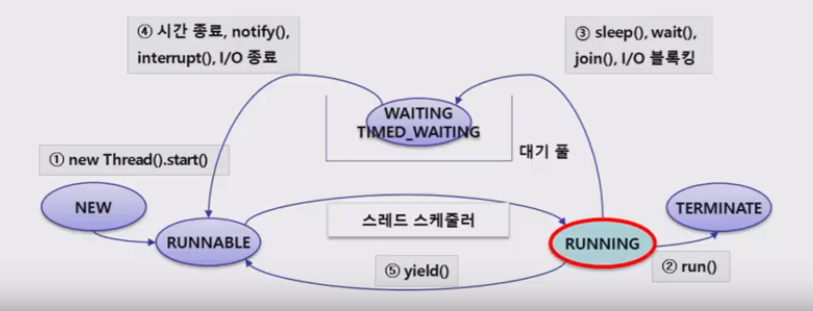

# Thread

- JVM 위에서 동작

<br>

## 1. Java Thread 이해

- 프로세스 : 개별적으로 동작하는 프로그램(이클립스, 메신저 등)

- 스레드 : 프로세스를 구성하는 작은 실행 단위(메신저 = 채팅 + 파일 전송)

- 멀티프로세스 : 동시에 여러 개의 프로세스를 실행하는 것

- **멀티스레드 : *하나의 프로세스*에서 여러 개의 스레드가 동시에 동작하는 것**

  - CPU 사용률 향상

    멀티스레드를 사용하면 동시에 여러 개의 스레드를 실행시키기 위해 CPU가 아주 바쁘게 움직이기 때문에 CPU의 활용률을 높일 수 있다.

  - 작업의 분리로 응답성 향상

    작업을 스레드 단위로 분리해서 **병렬 수행**할 수 있게 한다. 사용자의 입력을 기다리거나 파일 전송 등 시간이 걸리고 무거운 작업을 메인 스레드에서 분리시켜 수행함으로써 애플리케이션의 응답성을 향상시킬 수 있다.

<br>

<br>

## 2. Thread 생성

### Runnable 인터페이스 구현

- Runnable 인터페이스를 구현한 클래스를 만들고 `run()` 오버라이딩

- `run()`을 직접 부르면 `run()`을 호출하는 스레드가 직접 실행하고

- `start()`를 호출하면  job 스케쥴러에 등록되어 새로운 쓰레드가 생성되고 `run()`을 실행

- Runnable 객체를 만든뒤 Thread생성자의 파라미터로 넘겨줌

  ```java
  public static void main(String[] args){
      for(int i=0; i<1000; i++){
      	CoronaRunnable cr = new CoronaRunnable(i);
          Thread t = new Thread(cr);
          t.start();
      }
  }
  ```

  - thread가 순서대로 `start`되기 때문에 순서대로 동작할 거 같지만 실제로는 실행순서가 불규칙하다 => 동시성(concurrency)

<br>

### Thread 클래스 상속

- Thread 클래스는 Runnable을 구현하고 있다.

- Thread 클래스를 상속받은 클래스를 만들고 `run()` 오버라이딩

- Thread 클래스(Thread클래스를 상속받은 클래스) 객체를 생성한 뒤, 바로 실행

  ```java
  public static void main(String[] args){
      for(int i=0; i<1000; i++){
      	CoronaThread ct = new CoronaThread(i);
          ct.start();
      }
  }
  ```

  - Thread를 상속받는 경우는 코드 작성이 쉬워지지만 단일 상속의 제약에 의해 더 이상 다른 클래스를 상속받을 수 없다는 단점이 존재. 상황에 따라 적절한 방식을 선택하자

<br>

### run() vs start()

- `run()` : 스레드에서 수행할 적업을 정의하는 메서드

- `start()` : 스레드의 `run()`이 호출될 수 있도록 준비하는 과정

- **실제 `run()` 을 호출하는 것은 JVM이다**

  - `start()`가 호출되면 JVM이 운영체제의 스레드 스케쥴러에 의해 가능할 때 스레드의 `run()`을 호출한다. 따라서 우리 코드상에서는 `run()`을 호출하지 않는다

    => 우리가 직접 `main()` 을 호출하지 않는 것과 동일

- `main()` 을 호출하는 스레드는 **메인 스레드**

  

<br>

<br>

## 3. Java Thread 대기

### sleep

- parameter로 시간정보(millis : 1000 mili = 1sec)를 받음
- 대기 상태에 빠짐으로써 다른 Thread가 기회를 더 쉽게 가짐
- sleep사용시 main thread가 먼저 종료될 수도 있음
  - 나머지 thread들도 모두 종료시 프로그램 종료
- 설정 기간이 끝나거나 `interrupt()`가 호출되면 대기 풀에서 벗어나 다시 RUNNABLE 상태로 이동

<br>

### join

- `try-catch` 안에서 t thread에 join을 걸면, t thread를 실행시키고 자신은 sleep에 들어간다

  그리고 t thread가 종료되면 sleep에서 깨어난다

  - 만약 `main()`내에서 t라는 Thread가 있고, `t.join()` 이 실행되면, **메인스레드에서 t스레드에 join을 건것! **=> t 스레드가 실행되고 메인스레드는 대기상태에 들어간다 

<br>

<br>

## 4. Thread 상태



<br>

- 스레드 스케쥴러가 모든 스레드의 실행을 관리
- `start()` 를 호출하면 스레드가 runnable 상태에 들어감
- `run()`을 직접 부르면 `run()`을 호출하는 스레드가 직접 실행하고
- `start()`를 호출하면  job 스케쥴러에 등록되어 새로운 쓰레드가 생성되고 `run()`을 실행

<br>

- `interrupt()` 

  InterruptedException 발생시켜서 대기상태에 있는 스레드를 runnable 상태로 바꿔줌 

  => `sleep()` 과 `join()` 이 InterruptedException을 throws하는 이유

<br>

- `yield()`  : 실행 양보하지만, `sleep()` 처럼 대기 상태로 이동x, runnable 상태로 이동

- `stop()` : 강제 종료

  현재는 사용중지권고(deprecated)되어있음. 만약 스레드에서 다른 파일이나 네트워크 연결 등 시스템의 다른 자원을 사용 중이였다면 이 자원을 반납할 기회가 없기때문

<br>

<br>

## 4. Thread 동기화

### synchronized

- **공유 데이터의 lock**(모든 자바 객체는 lock을 가지고 있다)을 확보한 후 다른 스레드의 접근을 제한하고 배타적으로 사용

- method 또는 method내에 block 단위에 synchronized 키워드 사용가능

  => block 단위가 better

<br>

### wait

- 다른 스레드가 `notify()`, `notifyAll()`을 호출하기 전까지 현재 스레드를 WAITING상태로 유지 
- 반드시 synchronized영역에서 호출되어야 함

<br>

### notify

- 이 객체의 락인 필요한 **스레드 하나**를 WAITING 상태에서 RUNNABLE로 변경
- 객체의 락을 소유한 스레드가 호출해야됨

<br>

### notifyAll

- 이 객체의 락이 필요한 **모든 스레드**를 WAITING 상태에서 RUNNABLE로 변경
- 객체의 락을 소유한 스레드가 호출해야됨

###  

<br>

### 락의 이동

스레드가 공유 객체의 lock을 가진 상태에서 `wait()`을 호출하면 lock을 반납하고 대기풀에서 WAITING상태로 대기한다. 이후 다른 스레드가 이 객체의 `notify()` 또는 `notifyAll()`를 호출하면 대기풀로 이동했던 스레드가 다시 RUNNABLE로 이동한다

<br>

### DeadLock

- 서로 다른 스레드가 각각 lock을 가진 채로 다른 thread가 가진 자원을 wait하는 경우

<br>

<br>

## 5. Functional Interface

- 구현해야할 abstract 메서드가 하나인 인터페이스
- default 메서드는 여러개 가질 수 있음
- `@FunctionalInterface` 어노테이션 사용