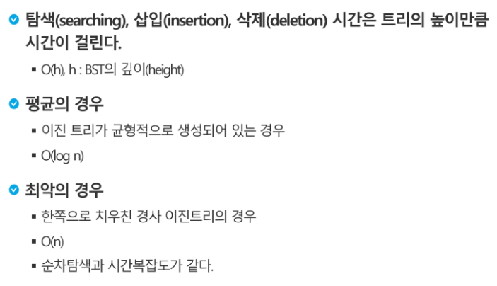

heap

- 완전 이진 트리로 관리되는 자료구조
- 최대힙, 최소힙

# 이진트리

 ## 순회

트리의 각 노드를 중복되지 않게 전부 방문하는 것

이진트리의 BFS 순회시 3가지의 방법

- 전위순회 : VLR
  - 부모노드 방문 후(처리 후), 자식노드를 좌, 우 순으로 방문
- 중위순회 : LVR
  - 왼쪽 자식노드, 부모노드, 오른쪽 자식노드 순으로 방문
- 후위순회 : LRV
  - 자식노드를 좌우로 방문한 후, 부모노드 방문

 

 

## 배열을 이용한 이진 트리의 표현

- 1차원 배열로 표현

- 루트의 번호를 1로함

- 배열의 크기는 2의 n승 -1

- 레벨 n의 루트노드는 2의 n승(왼쪽부터 오른쪽으로)

  > 

 

- 노드 번호를 배열의 인덱스로 사용

  > 

 

- 편향이진트리의 경우 메모리 공간적인 낭비가 심함

- 트리중간에 새 노드를 삽입하거나 기존의 노드를 삭제할 경우 배열 크기변경이 어려워 비효율적

  => 단점보완을 위해 **연결리스트**를 이용해 트리 표현

 

 

## 연결리스트를 이용한 이진트리의 표현

- 이진 트리의 모든 노드는 최대 2개의 자식 노드를 가지므로 아래와 같은 단순 연결 리스트 노드를 사용하여 구현

  > 

 

- 완전 이진 트리의 연결 리스트 표현

  - 단말노드의 경우 왼쪽 자식노드와 오른쪽 자식 노드가 null이다

  > 

 

 

## 수식트리(수식이진트리) (p411~)

- 서브트리의 연산결과가 피연산자가 되는 성질 이용,  recursive 한 성질
- 전위순회로 돌면 전위표기법의 수식이 되고, 중위순회로 돌면 중위표기식, 후위순회로 돌면 후위표기식이 됨

 

 

## 이진탐색트리 (p413~)

- 모든 원소는 서로 다른 유일한 키를 갖는다

  => 보통 중복값이 없는 경우 사용

- 중위순회하면 오름차순으로 정렬된 값을 얻을 수 있다

### 탐색 연산

### 삽입 연산

- 먼저 탐색 연산을 수행
  - 삽입할 원소가 트리에 있으면 삽입할 수 없으므로, 같은 원소가 트리에 있는지 확인
  - 탐색에서 탐색 실패가 결정되는 위치가 삽입 윛
- 탐색 실패한 위치에 원소 삽입

 

 

## 이진탐색트리 - 검색알고리즘의 비교

> 

> 

- 해쉬 검색 : unique한 해쉬코드가 필요
  - 추가저장공간이 필요 => 

 

 

## 힙

- 완전 이진 트리로 구현된 자료구조로서, 키값이 가장 큰 노드나 가장 작은 노드를 찾기에 좋은 자료구조
- 힙에서는 루트 노드의 원소만을 삭제 할 수 있다
- **힙의 종류에 따라 최대값 또는 최소값을 구할 수 있다**(최대 힙, 최소 힙)

 

### Priority queue 

- 힙의 키를 우선순위로 활용하여 우선순위 큐를 구현할 수 있다(p427)

 

### 최대 힙

- 키값이 가장 큰 노드를 찾기 위한 **완전 이진 트리**
- 부모노드의 키값이 자식노드의 키값보다 크다
- 루트 노드 : 키값이 가장 큰 노드

 

### 최소 힙

- 키값이 가장 작은 노드를 찾기 위한 **완전 이진 트리**
- 자식노드의 키값이 부모노드의 키값보다 크다
- 루트 노드 : 키값이 가장 작은 노드

 

### 힙의 연산 - 삽입

> 

 

### 힙의 연산 - 삭제

> 