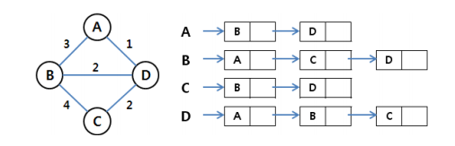

# 1. Tree(~p383)

- 계층형 자료구조
- node : 구성요소(=vertex)
  - root node
- Edge : node와 node의 연결(부모 - 자식) 1:N 관계
- 큐와 스택이용해서 풀면 **[자식은 하나의 부모밖에 없기때문에 visit 관리를 할 필요가 없다.!]** => 헷갈려서 하긴 함
- 노드의 차수 : 노드에 연결된 자식 노드의 수
  - 트리의 차수
- 노드의 높이 : 루트에서 노드에 이르는 간선의 수, 노드의 레벨
  - 트리의 높이

 

 

## 이진트리

- 모든 노드들이 2개의 서브트리를 갖는 특별한 형태의 트리
- 각 노드가 자식 노드를 **최대 2개**까지만 가질수있다.(없거나 1개도 가능하다는 뜻)
- 높이가 h인 이진트리
  - 가질 수 있는 노드의 최소 개수 : h+1
  - 가질 수 있는 노드의 최대 개수 : 2의 (h+1)승 - 1

 

 

## 포화이진트리

- 모든 레벨에 노드가 포화상태로 차 있는 이진트리
- 높이가 h인 포화이진트리
  - 가질 수 있는 노드의 최소 개수 : 2의 (h+1)승 -1

- **루트를 1번으로 하여 2의(h+1)승 -1 까지 정해진 위치에 대한 노드 번호를 가짐**

 

 

## 완전이진트리

- 높이가 h이고 노드 수가 n개일 때, 포화이진트리에서 노드 번호 1번부터 n번까지 빈 자리가 없는 이진 트리
- **최대힙, 최소힙** - 부모가 나보다 크거나 작다. 
- 위로 올라가면서 탐색을 하니까 log N의 시간 복잡도를 가진다.

 

 

BFS, DFS : 그래프 탐색 방법

# 2. BFS(~p309) 

- 루트 노드로부터 간선수를 기준으로 같은 노드들을 먼저 모두 차례로 방문하는 방식(우선순위가 동일한 노드들 = 형제노드)
- 형제노드들에 대해 탐색을 한 후, 각 형제노드들 차례로 다시 자식들을 탐색하는 너비우선탐색을 진행해야하므로, 선입선출 형태의 자료구조인 **큐를 활용**
- 내 자식들은 형제 노드들 탐색이 끝난뒤에 처리해야하므로 큐의 대기열에 넣어줌
  - B를 방문했다면, C,D를 차례로 방문해야하기 때문에 큐마지막에 넣어줌(D 뒤에 E,F가 있게된다)
- **들어갈때 visited**
  - 나올떄 visited 처리를 하면 똑같은 노드를 중복해서 처리하는 현상이 발생할 수 있음
  - 인접한 노드를 모두 큐에 넣기 떄문에, 다른 노드와 큐에 넣는 노드들이 중복될 수 있다.
  - 그래서 들어갈때 처리된것처럼 visited 처리를 해준다
- **가중치가 없는** 그래프 최단거리 구하기에 유리

 

 

# 3. DFS(~p177)

- 보통 재귀 사용하는게 일반적(80-90%)
- Stack 사용하면 재귀안써도 구현가능
- 이미 지나온 노드는  visitied 처리
  - 끝나고 visited = false 처리 하지 않음
- **나올때 visited**

 

 

# 4. Graph

- 다대다 관계 표현

## 인접행렬 (정점중심)

- 간선의 방향성 고려(트리에서는 보통 부모에서 자식으로 수직적인 관계기 떄문에 신경쓰지 않았다)
- 두 vertex가 간선으로 연결되어있다
- 인접여부를 행렬로 표시
-  2차원배열로 표현(인접여부만 따질떄는 boolean)
  - 추가 정보를 저장하려면 보통 int형 배열(거리, 시간...) => 간선의 가중치
- 대칭적 형태
- n이 크지 않으면서도 간선이 많을 때
  - n=10000 이면 10000x10000 이고 너무 크다.
  - 간선이 의미가 있는 경우가 많기 떄문에 n이 크지 않고 간선이 많을 때 사용한다

 

## 인접리스트 (정점중심)

- 인접한 노드들만(간선정보가 있는 **노드**들만) 모아서 포인터로 연결..? => LinkedList 사용(큐 말고), head
- 정점이 많은데 간선이 적은 경우 효율적 => 공간의 효율성
- 처리속도가 빠르다 

> 

 

## 간선리스트 (간선중심)

- 간선정보로 list
- 크루스칼 알고리즘 (최소비용 신장트리)
  - 처음에 모든 정점이 떨어져있다고 가정
  - 입력된 간선정보로 정점 연결 => 비용이 작은 간선부터 정렬
  - 트리형태로 만들기! => N-1개의 간선을 사용하면 트리 형태가 된다
  - 싸이클 테이블 : 사이클이 발생하면 안됨
  - 유니온 알고리즘 사용