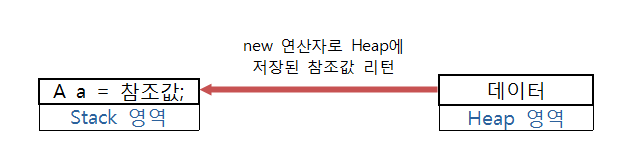

# 객체지향

## 1. Amateras Modeler

> https://offbyone.tistory.com/182\

<br>

- 이클립스 플러그인 UML, ERD 그리기 도구

<br>

<br>

<br>

## 2. JavaDoc만들기

> Java 소스의 문서화

<br>

### 주석처리

- Java 소스의 문서화를 위해 다음과 같이 주석을 처리한다

- `/**` + `enter` 누르면 JavaDoc생성시 사용되는 주석이 만들어진다

  ```java
  /**
   * <pre>
   * 회원 정보(Data)와
   * 기능을 구현한 클래스
   * </pre>
   * 
   * @author multicampus
   * @version 1.0
   * @see MovieTest
   */
  ```

<br>

### JavaDoc 생성

1. Java 소스의 문서화를 위해 다음과 같이 주석을 처리하고 커맨드 명령을 수행하게 되면 html 문서가 생성된다

```bash
javadoc -d doc -private *.java
```

<br>

2. 패키지 우클릭 => export => JavaDoc => vm options `-encoding UTF-8` 입력 =>  완료

<br>

- 속성은 여러가지가 있다

<br>

<br>

<br>

## 3. JVM Memory 구조

- Java는 메모리 관리를 GC(Garbage Collection)라는 쓰레드를 생성하여 관리하도록 설계했다. 
- 저장영역은 크게 static 영역, heap, stack이 있다

<br>

### static 영역(Method area)

- classLoader : 하드 디스크에 있는 번역된 class 파일을 메모리로 읽어온다.
- 메모리로 읽어온 클래스의 정보를 기억하는 곳, 클래스를 로딩하여 저장하는 공간
- heap에 객체를 만들지 않고 사용하는 정보들을 위한 영역
- 프로그램의 시작부터 종료때까지 메모리에 남아있는다
- class정보(전역변수), static정보(정적 멤버변수) 등

<br>

### heap

- 객체를 생성하는 공간

- reference data type에 해당되는 객체, 배열 등의 데이터가 저장되는 공간

- **실제 데이터를 갖고 있는 Heap 영역의 참조 값을 Stack 영역의 객체가 가지고 있음(new 연산자를 통해)**

  > 

<br>

### stack

- primitive data type에 해당되는 지역변수의 데이터의 값이 저장되는 공간
- 프로그램 수행 시 로컬변수가 중간결과를 저장하는 곳
- 메서드 수행 시마다 메서드 수행에 필요한 변수나, 중간 결과 값을 임시기억 하는 곳
- 메서드 종료 시 할당 메모리 자동 제거

<br>

### Garbage Collection

- heap 영역(class 영역 포함)에 생성된 객체들의 메모리 관리를 담당하는 프로그램

<br>

<br>

<br>

## 4. Constructor(생성자)

- 생성자는 **첫줄에서** 호출되어야한다
- default 생성자 : 객체 생성시 자동호출된다
- 개발자가 명시적으로 만들지 않으면 컴파일러가 자동으로 기본생성자를 만들어준다

<br>

### 생성자 Overloading

- 자바에서는 **이름**과 **파라미터**가 같으면 같은 메서드로 봄 => 메서드의 시그니처:star:
- 오버로딩은 이름은 같으나 파라미터가 다른것. 여러가지 생성자를 만들 수 있다
- 객체지향의 특징을 잘 보여주는 예

<br>

<br>

<br>

## 5. this

- 객체 생성시 그 객체의 레퍼런스를 저장하기 위한 this 레퍼런스가 자동 생성된다
- this.메서드명() : 현재 실행중인 객체의 메서드
- this(파라미터 옵션) : 현재 실행중인 객체의 다른 생성자
  - 반드시 생성자의 첫라인에서 사용

<br>

<br>

<br>

## 6. Method

### Variable

- **Member variable**

  - 클래스 변수(클래스 내에 정의되는 variable)

  - 메모리 영역 중 heap에 생성

  - **static**

    - object가 공통적으로 갖는 데이터. 클래스 이름으로 접근가능하고 1개만 존재

    - 클래스가 메모리에 로딩시에 메모리 할당이 이루어진다 

    - static 변수는 static 메서드로 접근

      ```java
      public class MemberTest {
      
      	
      	static int N;
      	public static void main(String[] args) {
      		Member m = new Member("soooy", 26, "soooy@soooy.com");
      		m.memberInfo();
      		
      		System.out.println(Member.MAX_NUM);
      		m();
      		
      		N = 5;
      	}
      	
      	public static void m() {
      		N = 10;
      	}
      }
      ```

<br>

<br>

- **Local Variable**
  - 메서드나 생성자 내에 정의되는 variable
  - 메모리 영역 중 stack에 생성

<br>

<br>

<br>

## 7. 오버로딩

- **같거나 비슷한 일을 하는 메서드 구현 시**에 메서드의 이름을 같게 정의하고 파라메터는 다르게 해서 사용을 편리하게 한다
- 제한자, return-type은 상관없음

<br>

<br>

<br>

## 8. Access Modifier(클래스)

- 접근 제한자
- default 
  - 상속관계에서 접근 불가능 - 같은 클래스, 같은 패키지 내에서만 사용 가능
  - 하지만 같은 패키지 내에서 상속을 받게 되면 사용가능하다
    - 다른 패키지면 상속관계시 사용불가능

<br>

- protected 

  - 같은 패키지 내에서 사용가능 
  - 패키지가 다르면 사용할 수 없으나, 상속을 받았다면 사용할 수 있다.

  > 

<br>

<br>

<br>

## 9. Usage Modifier

- static
  - 객체 생성없이 사용하고자 할 경우

<br>

- final
  - 변경할 수 없음을 의미
  - 상속불가

<br>

- abstract
  - 미완성임을 의미
  - 메서드의 선언부만 있는 클래스
  - body가 없는 클래스
  - interface랑 겹침

<br>

<br>

<br>

## 10. Encapsulation

> 클래스 설계시 중요한 데이터나 복잡한 구현은 숨기고, 사용에 꼭 필요한 기능만을 공개하여 정의하는 기법

<br>

- 중요하거나 상세한 구현은 숨긴다(private)
- 멤버변수(private)
- 같은 패키지내에서 멤버변수에 접근해야하는 메서드는 protected
  - setXxx(), getXxx() 등을 통해 접근, 제어
- 모두에게 접근허용하는 기능, 데이터는 public
- *캡슐화를 적용하게 되면, 필요한 기능만 공개되어 있기 때문에 사용이 편리해지고, 코드의 유지보수를 용이하게 만든다!*

<br>

<br>

<br>

## 11. API

- java.lang : 자바의 기본적인 클래스 


## 11. 오버라이딩

- 상속
- 재정의