# 단어의 분산표현(Word Embedding)

```markdown
Tokenization.ipynb 참고
```

<br>

## 1. 단어의 의미 이해 시키기

- 단어 : **말의 의미**를 구성하는 최소 단위 (형태소는 뜻을 구성하는 최소 단위)
- 컴퓨터에게 '단어의 의미'를 이해시키기 위한 기법
  - 시소러스 활용 기법 : 유의어 사전(사람이 만든)
  - 통계 기반 기법
  - 추론 기반 기법(word2vec)

<br>

- WordNet : 자연어 처리에서 가장 유명
- NLTK : WordNet의 Python Interface 모듈

<br>

<br>

## 2. Word Embedding

> 단어의 의미를 정확하게 파악할 수 있는 벡터형태로 (여러 개의 숫자로 ) 표현된 값

<br>

- 색에 고유한 이름을 붙이는 것보다 R/G/B와 같이 벡터형태로 표현하는 것이 더 간결하고 정확하게 명시 할 수 있다

<br>

<br>

## 3. 통계 기반 기법

### 분포 가설 

- 통계 기반 기법의 근거

- 단어 자체에는 의미가 없고, 사용된 '맥락'이 의미를 형성

- 맥락을 분석하기 위해 윈도우 크기(Window Size)를 지정해 특정 단어와 그 주변에 발생하는 단어들을 함께 묶어 분석

  > 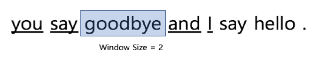

<br>

<br>

### 동시발생 행렬(co-occurrence matrix)

- Center Word 주변에 어떤 단어가 몇 번이나 등장하는지를 세어서 집계한 행렬

- 통계적 기법이라고도 함

- 동시 발생 행렬의 발생 빈도를 해당 단어를 의미하는 벡터 정보로 사용

- 임베딩(Embedding) : 단어를 벡터로 표현하는 과정

  > 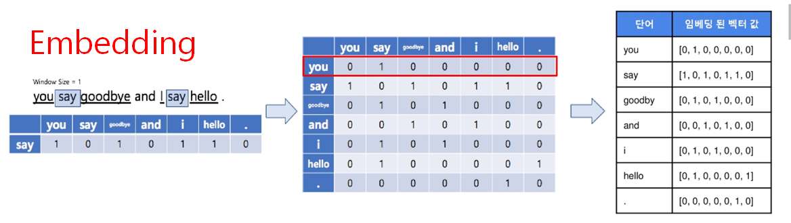

<br>

<br>

### 동시발생 행렬을 통한 분석의 한계

- 고빈도 단어(a, the 같은 관사)의 경우 의미상 관계성이 높지 않아도 발생빈도수가 높아 관계성이 높은 것으로 분석 될 수 있음

- ex ) 'the', 'car' VS 'drive', 'car' => 관계성은 'drive'가 높지만 동시 발생 빈도는 'the'가 높음

  => **PMI 사용**

<br>

<br>

### PMI : 점별 상호정보량(Pointwise Mutual Information)

- 빈도수에 기반한 동시 발생 행렬의 문제점 해결

- 각 단어가 발생하는 확률 값으로 나누어 고빈도 단어에 대해서 패널티 부과

  > 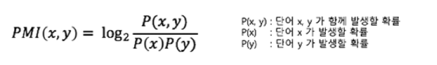

  <br>

  > 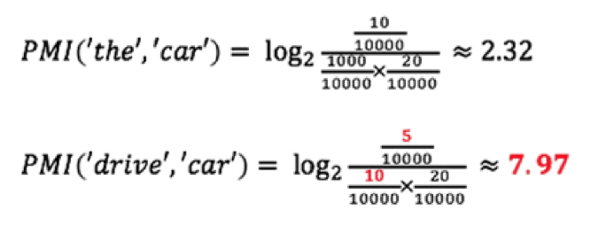

<br>

<br>

## 4. 추론 기반 기법(word2vec)

- 통계 기반 기법의 문제점

  - 현실의 대규모 말뭉치를 다룰 때 처리가 불가능한 수준의 matrix가 만들어짐

  - 단어의 분산표현을 갱신해야 하는 경우 전체 데이터를 다시 학습시켜야함
  - 신규 어휘 추가

<br>

<br>

- 추론 기반 기법이란?

  - '분포가설'에 기반하여 맥락(Context)을 이용해 **Center word를 추론**하는 작업

  - 인공신경망을 이용해 단어의 출현 확률 분포를 모델링

    > 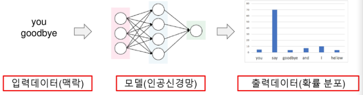

<br>

<br>

- 추론 기반 기법(word2vec) - 2가지 알고리즘 존재
  - CBOW 모델
  - skip-gram 모델


<br>

<br>

###  추론 기반 기법을 위한 단어의 전처리

- 원-핫 인코딩(one-hot encoding) - 단어에게 unique한 id를 주는 방식

  - 인코딩 결과를 원-핫 벡터라고 함

    > 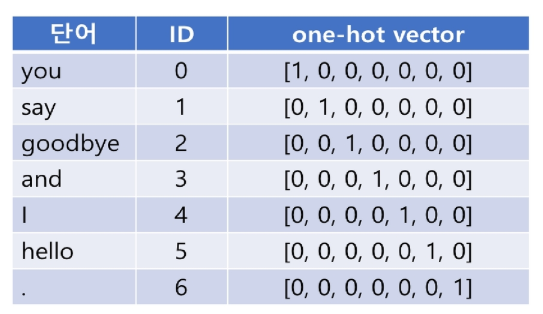

<br>

<br>

### 추론기반기법1 - CBOW 모델

> 

<br>

- Center word가 무엇일지 추리

- Skip- gram 모델보다 더 빠름

  > 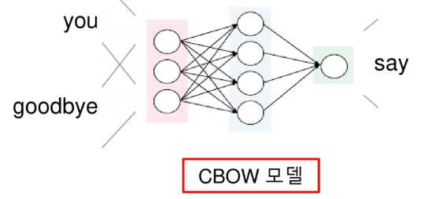

<br>

<br>

### 추론기반기법2 - Skip-gram 모델

> 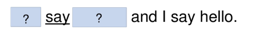

<br>

- 하나의 단어를 주고 나머지 단어들을 추론하는 방식

- CBOW 모델보다 성능이 더 뛰어남

- 학습 대상 말뭉치가 커질수록 skip-gram이 더 뛰어난 성능 발휘

  > 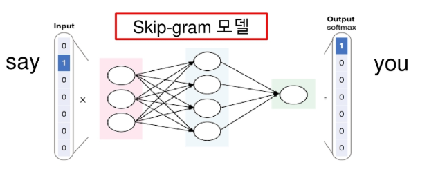


<br>

### 추론 기반 기법의 장점

- 단어의 분산표현을 갱신(신규 단어 추가, 단어의 의미 변화)해야 하는 경우, 기존에 학습된 가중치를 초기값으로 사용

  - 기존에 학습한 경험을 해치지 않으면서 분산 표현을 효율적으로 갱신

  <br>

- 통계 기반 기법에서는 유사성만이 인코딩 되는 반면, **단어 사이의 패턴**도 학습됨

  > 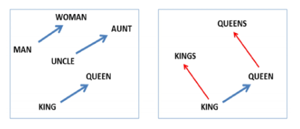

<br>

<br>

<br>

## 5. 단어간 유사도 측정

- 벡터 간 유사도(similarity)
  - 벡터의 내적, 유클리드 거리, **코사인 유사도** 등등

<br>

- 주요 라이브러리

  - gensim 

    - word2vec 알고리즘 구현체

    - python에서 라이브러리 형태로 import해서 사용

      ```python
      # 추론 기반 기법
      # word2vec 모델 생성
      
      # gensim 설치
      !pip install gensim
      
      # gensim 
      from konlpy.corpus import kobill
      from konlpy.tag import Okt
      from gensim.models import word2vec
      
      docs_ko = [kobill.open(i).read() for i in kobill.fileids()]
      
      t = Okt()
      pos = lambda d:['/'.join(p) for p in t.pos(d)]
      texts_ko = [pos(doc) for doc in docs_ko]
      
      wv_model_ko = word2vec.Word2Vec(sentences=texts_ko, size=100, window=5, min_count=1, sg=1)
      print(wv_model_ko.most_similar(pos('부대')))
      
      wv_model_ko.save('ko_word2vec_e.model')
      ```

      <br>

      ```
      // 실행 결과
      [('국군/Noun', 0.9924178123474121), ('\n\n          /Foreign', 0.9916089773178101), ('○/Foreign', 0.9900531768798828), ('UAE/Alpha', 0.9885621666908264), ('파견/Noun', 0.9880470037460327), ('\n\n    /Foreign', 0.9875251650810242), ('의안/Noun', 0.9840103387832642), ('소말리아/Noun', 0.9833748936653137), ('해역/Noun', 0.9833218455314636), ('동/Modifier', 0.982685923576355)]...
      ```

    <br>

    <br>

  - fasttext

    - facebook에서 만든 word2vec 알고리즘 구현체

    - 최근 gensim 에서 wrapping하여 python에서 사용

    - 문자 단위로도 분산표현을 생성하여 학습데이터에 존재하지 않는 단어 분석 가능

      ```python
      # fastText
      # Word2vec 모델 생성
      
      from konlpy.corpus import kobill
      from konlpy.tag import Twitter
      from gensim.models import FastText
      
      docs_ko = [kobill.open(i).read() for i in kobill.fileids()]
      
      ft_model = FastText(size=125, window=3, min_count=1)
      ft_model.build_vocab(sentences = texts_ko)
      ft_model.train(sentences=texts_ko, total_examples=len(texts_ko), epochs=10)
      
      print(ft_model.most_similar(pos('부대')))
      
      ft_model.save('ko_word2vec_ft.model')
      ```

      <br>

      ```
      // 실행 결과
      ...
      [('소말리아/Noun', 0.9996811151504517), ('기획재정부/Noun', 0.9996735453605652), ('일부/Noun', 0.9996705651283264), ('파견/Noun', 0.9996447563171387), ('아랍에미리트/Noun', 0.9996353387832642), ('청해부대/Noun', 0.9996314644813538), ('연장/Noun', 0.9995715022087097), ('외교통상부/Noun', 0.9995635747909546), ('여성가족부/Noun', 0.9995517134666443), ('정부/Noun', 0.9995303153991699)]
      ```

<br>

<br>

### pre-trained word2vec 모델

- 다른 사람들이 만들어 놓은 모델 사용 가능
- https://fasttext.cc/docs/en/pretrained-vectors.html

<br>

<br>

<br>

## 6. 차원감소

> 벡터의 '중요한 정보는' 최대한 유지하면서 차원을 줄이는 방법

<br>

- 적합한 축을 찾아내는 일이 중요!

- ex ) 2차원 => 1차원

  > 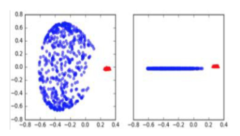

<br>

<br>

### 차원 감소 주요 알고리즘(축을 찾아내는 알고리즘)

- 특잇갓분해
- 주성분분석
- t-SNE