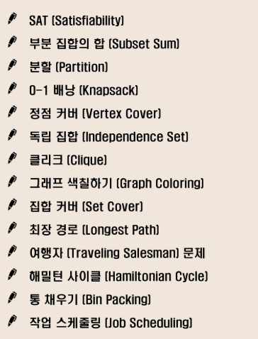

# 반복과 재귀

- 반복과 재귀는 유사한 작업을 수행할 수 있다.
- 반복과 재귀는 수행하는 방식이 다를뿐이다

<br>

- 반복 : 수행하는 작업이 완료될 때까지 계속 반복
  - 프로그램 제어와, 나에게 필요없는 정보들도 관리를 해줘야함
  - 루프(for, while)
  - 무한반복시 CPU를 반복해서 점유

<br>

- 재귀 : 주어진 문제의 해를 구하기 위해 동일하면서 더 작은 문제의 해를 이용하는 방법

  - 하나의 큰 문제를 해결할 수 있는 더 작은 문제로 쪼개고 결과들을 결합

  - 재귀 함수로 구현

  - 함수 호출은 프로그램 메모리 구조에서 스택을 사용한다. 따라서 재귀호출은 반복적인 스택의 사용을 의미하며 메모리 및 속도에서 성능저하가 발생한다. 입력 값 n이 커질수록 재귀 알고리즘은 반복에 비해 비효율적일 수 있다

    => memoization사용

  - 무한반복시 스택 오버플로우

<br>

```markdown
- 넥퍼는 선수행 후조건 
  - 만들수있는 순열 모두 만든다음에 ,,,?
- 내가 만들고 싶은 순열 제일 작은거부터 만듬
- 첫순열은 내가 만들어야함 => 그다음에 넥퍼
- 그래서 넥퍼 쓰면 do-while안써도 됨
```

<br>

<br>

## 완전탐색(brute-force)

- 자료의 크기가 작다면 유용 
- 보통 조합적 문제들과 연관됨
- 완탐은 조합적 문제에 대한 brute-force 방법이다
- 문제유형

> 

<br>

<br>

## 비트마스킹 순열

- Integer.toBinaryString(selected) : 디버깅할때 이진수로 확인가능

- selected는 primitive 타입이라 값이 복사되므로, boolean 배열처럼 초기화 해주지 않아도된다

  ```java
  //비트마스킹 순열
  public class P01_BitmaskingTest {
  
  
      static int N,R;
      static int[] numbers,pick;
      static int totalCount;
  
      //4개중에서 3개뽑는 순열
      public static void main(String[] args) {
          numbers = new int[] {1,2,3,4};
          N = numbers.length;
          R = 3;
          pick = new int[R];
          permutation(0,0);
          System.out.println("총 경우의 수 : "+totalCount);
      }
  
      private static void permutation(int index, int selected) {	//selected : 기존 boolean 배열 => 비트열
          if(index == R) {
              totalCount++;
              System.out.println(Arrays.toString(pick));
              return;
          }
  
          for(int i=0; i<N; i++) {
              if((selected & 1<<i)==0) {	//사용중이 아니면
                  pick[index] = numbers[i];
                  permutation(index+1, selected | 1<<i);
              }
          }
      }
  
  }
  
  ```

<br>

<br>

## Swapping 순열

- 원래 있던 수들을 교환하는 방식으로 순열만드는 방식 => pick(뽑는다)라는 개념이 없다

- 어느 위치를 기준으로 교환할 것인지(자신을 포함한 뒤에 있는 원소들과만 교환한다) 

  => 인자는 index하나만 필요

- 기준이 될 인덱스와 나머지 원소들을 정확히 교환하기 위해 순열을 만든뒤, 자기 자신으로 되돌아와야한다

  ```java
  public class P02_SwapTest {
      static int N,R,totalCount;
      static int[] numbers;
  
      //원래있던 수들을 교환하는 방식으로 순열 만듦 => pick(뽑는다)라는 개념이 없음
      public static void main(String[] args) {
          numbers = new int[] {1,2,3,4};
          N = numbers.length;
  
          //교환을 허용하는 위치, 2이면 앞에 두개만 보면된다;
          R = 4;	
  
          //어느 위치를 기준으로 교환할 것인지(자신을 포함한 뒤에 있는 원소들과만 교환)
          //swaping은 돌아오는것까지 두번해줘야함
          permutation(0); 
          System.out.println("총 경우의 수 : "+totalCount);
      }
  
      private static void permutation(int index) {
          if(index == R) {
              totalCount++;
              System.out.println(Arrays.toString(numbers));
              return;
          }
  
          for(int i=index; i<N; i++) {
              swap(index, i);
              permutation(index+1);
              swap(index, i);
          }
      }
  
      private static void swap(int a, int b) {	
          //swap할 index를 준다
          //numbers주면 교환 안일어남
          int temp = numbers[a];
          numbers[a] = numbers[b];
          numbers[b] = temp;
      }
  }
  ```

<br>

<br>

## Next Permutation

```markdown
1. 교환이 필요한 위치(i-1) 찾기
2. 교환대상(j) 찾기
3. i-1위치값과 j위치값 교환 : i-1을 한단계 큰 수로 만듦
4. i위치부터 맨뒤까지 내림차순의 형태를 오름차순 형태로 재조정
```

<br>

```java
public class P03_NextPermutationTest {

    //npr안됨. npn만 가능
    static int totalCount;

    public static void main(String[] args) {

        int[] numbers = {1,2,3,4};
        Arrays.sort(numbers);
        do {
            System.out.println(Arrays.toString(numbers));
        }while(np(numbers));

        System.out.println("총 경우의 수 : "+totalCount);
    }

    private static boolean np(int[] p) {
        totalCount++;

        int N = p.length;

        //1. 교환이 필요한 위치(i-1) 찾기
        int i = N-1;	//i-1이 i보다 작아지는 상황이 되어야함
        while(i>0 && p[i-1] >= p[i])--i;	//교환이 필요한 i-1위치 찾기(i:꼭지)
        if(i==0) return false;	//이미 가장 큰 순열이므로 다음순열 생성 불가

        //2. 교환대상(j) 찾기
        int j = N-1;
        while(p[i-1]>=p[j])--j;

        //3. i-1위치값과 j위치값 교환 : i-1을 한단계 큰 수로 만듦
        int temp = p[i-1];
        p[i-1] = p[j];
        p[j] = temp;

        //4. i위치부터 맨뒤까지 내림차순의 형태를 오름차순 형태로 재조정
        j = N-1;
        //i뒤에 있는 오름차순되어있는 순열을 내림차순으로 바꿔줌
        while(i<j) {	//뒤에서부터 꼭지까지 가면서
            temp = p[i];
            p[i] = p[j];
            p[j] = temp;
            i++;
            j--;
        }

        return true;
    }
}

```

