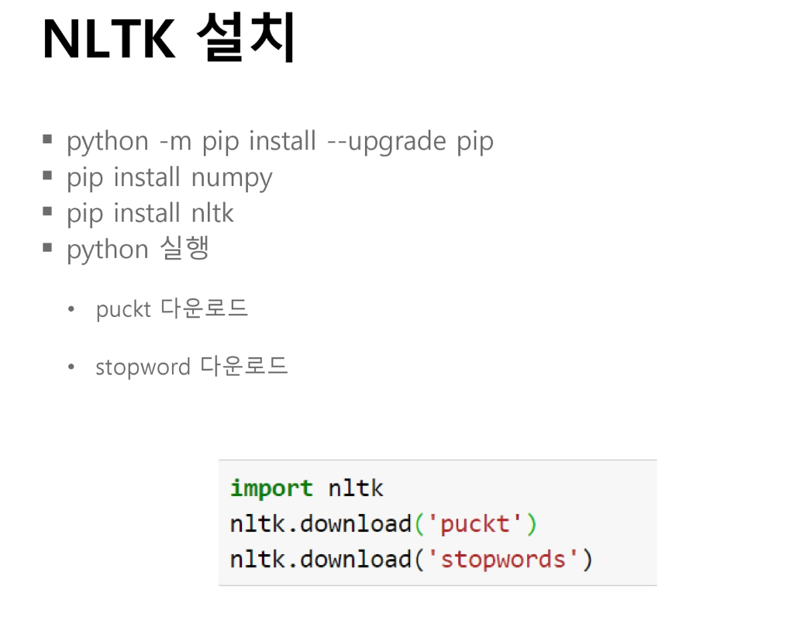
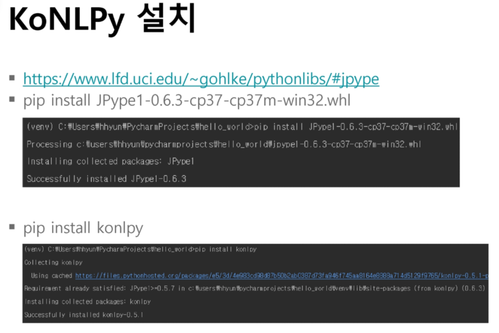
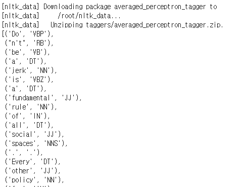
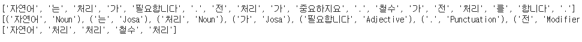
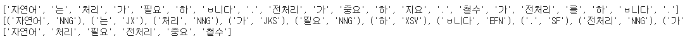
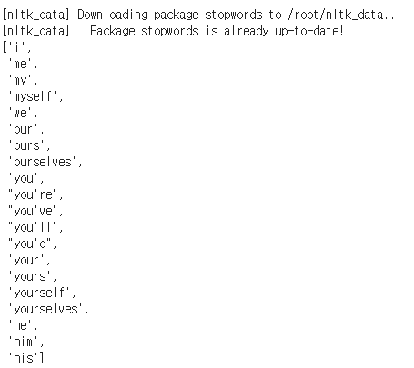
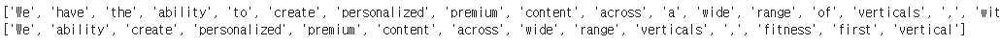
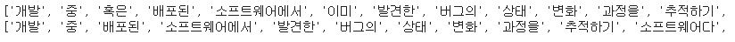
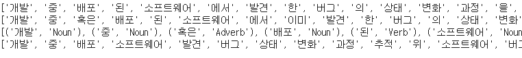

# 자연어 처리

> 자연어란_사람이 사용하는 언어
>
> 자연어 처리란_사람이 사용하는 언어를 컴퓨터에게 이해시키기 위한 기술

<br>

### Hard language 

- 코드 같은 '딱딱한' 언어
- 문법이 있음
- 정해진 규칙에 따라 해석

<br>

### Soft language

- '한국어', '영어' 등
- 같은 의미의 문장도 여러 형태로 표현 가능
- 의미나 형태가 유연하게 변경

<br>

### 자연어 처리 적용 분야

- 정보 검색
  - 구글로 대표되는 검색 엔진을 만드는 학문

<br>

- 음성 인식
  - Siri, Google Assistant

<br>

- 문장/문서 분류
- 감정 분석
  - 구매 사이트 등에서 후기 분석

<br>

### 자연어 처리 작업 흐름

**말뭉치 수집 => 자연어 전처리 => 모델 구현**

<br>

### 딥러닝과 자연어 처리

- 기존 자연어 처리 방식
  - 규칙 기반 : 어머니만 인정하고, 어무이는 인정안하게 규칙 설정
  - 통계 기반 : 사과가 나오면 먹었다는 동사가 많이 나오는 통계 기반 처리
  - 머신러닝(추론 기반) : 문장 사이 빈칸에 들어갈 말 추론

<br>

- 딥러닝 기술이 발전 하면서 자연어 처리 성능 급격하게 증가
  - RNN 등 딥러닝 알고리즘

<br>


### 자연어 전처리

- 대부분의 자연어 데이터는 정제되어 있지 않은 상태

- 전처리는 본격적인 처리 전에 데이터의 복잡성을 감소시킴 => 자연어 처리 성능을 높이기 위한 핵심 작업

- 전처리 방법

  - Tokenization : 단어를 쪼갬
  - 정제 및 정규화 
    - 정제 : 자연어에서 콤마나 구두점 등을 제거
    - 정규화 : 처리하기 간단하고 핵심이 되는 단어로 뽑아내기

  - Stop word 제거 : 음, 어, 아.. 크게 의미가 없는 것들 제거

<br>

<br>

<br>

 ## 1. 환경설정

- Python, Java, Pycharm, **NLTK, KoNLPy** 설치

<br>

### 1.1 NLTK(Natural Language Toolkit)

- 교육용을 개발된 자연어 처리 및 문서 분석용 파이썬 패키지

- 말뭉치, 토큰생성, 품사

  > 

<br>

### 1.2 KoNLPy

- 한국어 정보처리에 특화된 파이썬 패키지

- 말뭉치, 토큰생성, 형태소 분석, 품사 태깅

  > 

<br>

<br>

## 2. 토큰 생성 시 고려할 점

- 구두점이나 특수 문자를 단순 제외해서는 안 됨
  - 마침표는 종료를 알 수 있는데 도움이 됨
  - 느낌표는 문장의 느낌을 파악하는데 도움이 됨

<br>

- 줄임말과 단어 내에 띄어쓰기가 있는 경우
  - we're => we are
    - `'` 로 붙어 있지만 두 개의 단어로 보는 것이 합리적
  - New York, Mc Donald
    - 띄어쓰기가 있지만 하나의 단어로 보는 것이 합리적

<br>

- 문장 단위 토큰 생성 시
  - 줄임말 중간에 마침표 존재 할 수 있기 때문에 고려해서 작업

<br>

### 단어 단위 토큰 생성

```python
# 단어 단위
# NLTK 라이브러리를 통한 토큰 생성
import nltk
from nltk.tokenize import word_tokenize
from nltk.tokenize import WordPunctTokenizer

nltk.download('punkt')

# 구두점이나 특수 문자를 어떻게 처리하는지

# 'Do',
# "n't",
word_tokenize("Don't be a jerk is a fundamental rule of all social spaces. Every other policy for getting along with others is a special case of this rule.")

# 구두점, 띄어쓰기, 특수문자 마다 tokenize
# 'Don',
#  "'",
#  't',
WordPunctTokenizer().tokenize("Don't be a jerk is a fundamental rule of all social spaces. Every other policy for getting along with others is a special case of this rule.")
```

<br>

<br>

### 문장 단위 토큰 생성

```python
# 문장 단위 Tokenization

import nltk
from nltk.tokenize import sent_tokenize

text="Droxford railway station was a small station on the Meon Valley Railway, built to a design by T. P. Figgis and opened in 1903. It served the villages of Droxford, Soberton and Hambledon in Hampshire, England.[A] The railway served a relatively lightly populated area, but was built to main line specifications in anticipation of it becoming a major route to Gosport. Consequently, although the station was built in an area with only five houses, it was designed with the capacity to handle 10-carriage trains. It initially proved successful both for the transport of goods and passengers, but services were reduced during the First World War and the subsequent recession, and the route suffered owing to competition from road transport."

sent_tokenize(text) # T. P.의 경우 마침표가 있어도 문장으로 쪼개지지 않음

print(sent_tokenize(text))
print(len(sent_tokenize(text))) # 5개의 문장으로 쪼개짐
```


<br>

<br>

## 3. (영어)품사 태깅

> 각 토큰이 어떠한 품사인지 구분하는 작업

<br>

- pos (Part of Sentence)

- 동일한 형태의 토큰이 품사에 따라 의미가 달라짐
  - Fly - 날다(동사), 파리(명사)

<br>

### 품사 태깅

```python
# 품사 태깅
import nltk
from nltk.tokenize import word_tokenize
from nltk.tag import pos_tag

nltk.download('averaged_perceptron_tagger')

text="Don't be a jerk is a fundamental rule of all social spaces. Every other policy for getting along with others is a special case of this rule. I’m a Ph.D." 

x = word_tokenize(text)

pos_tag(x) # 문자열 토큰이 품사 정보가 추가되어 튜플 객체로 변함
```

<br>

> 

<br>

<br>

## 4. 한국어 Tokenization

> 한국어 Tokenization은 형태소 개념이 중요하다!

<br>

- 한국어는 띄어쓰기로 Tokenization할 경우 유의미 하지 않음

  - 한국어는 띄어쓰기가 잘 안 지켜짐
  - ex ) 약속한대로, 약속한 대로?

  <br>

- 한국어에는 조사가 존재

  - 그 - '그가', '그에게' 와 같이 다양한 조사가 '그'라는 글자 뒤에 띄어쓰기 없이 바로 붙음
  - 같은 단어임에도 서로 다른 조사때문에 다른 단어로 인식

  <br>

- **한국어 Tokenization는 형태소 개념이 중요**

  - 형태소 : **뜻을 가진 가장 작은 말의 단위**
  - 새가 하늘을 날았다
    - 자립 형태소 : 새, 하늘
    - 의존 형태소 : 가, 을, 날, 았, 다

  <br>

- 한국어에서 영어에서의 **단어 Tokenization**와 유사한 형태를 얻으려면 **형태소 Tokenization**을 수행해야 함

<br>

<br>

<br>

## 5. 한국어 토큰 생성, 품사 태깅

- KoNLPy라는 파이썬 패키지 이용 
- KoNLPy : 여러 형태소 분석기를 Wrapping한 라이브러리
  - Okt, Mecab, 코모란, Kkma 등등
  - Mecab-KO : 일본어 형태소 분석기 Mecab을 한국어 분석기로 포팅
    - 성능이 가장 빠름
  - 코모란 
    - 오탈자, 띄어쓰기 등에 강함

<br>

### Okt

```python
from konlpy.tag import Okt
okt = Okt()
text = "자연어는 처리가 필요합니다. 전처리가 중요하지요. 철수가 전처리를 합니다."

print(okt.morphs(text)) # 형태소 분석
print(okt.pos(text)) # 품사 태깅
print(okt.nouns(text)) # 명사만 추출
```

<br>

> 

<br>

<br>

### Kkma

```python
from konlpy.tag import Kkma
kkma = Kkma()
text = "자연어는 처리가 필요합니다. 전처리가 중요하지요. 철수가 전처리를 합니다."

print(kkma.morphs(text))
print(kkma.pos(text))
print(kkma.nouns(text))
```

<br>

> 

<br>

<br>

### Mecab

-  `macab_insall` 파일 참조

<br>

<br>

<br>

## 6. 텍스트 정제 및 정규화

> 실제 자연어 처리 전 데이터의 복잡도를 낮추기 위해 정제 및 정규화 진행

<br>

- 정제(Cleaning) : 노이즈 데이터 제거, 음,,,어,,, 등등

- 정규화(Normalization) : 단어들 통합시켜서 같은 단어로 만듦

  - 같은 의미를 갖고 있음에도, 표기가 다른 단어들을 하나의 단어로 정규화
  - ex ) USA, US / Aha~ 와 a-ha!

  <br>

- 대소문자 통합

  - Book -> book

  <br>

- 유의미하지 않은 단어 제거

  - A, an, the, 음.., 아.,,,

  <br>

- 등장 빈도가 적은 단어

- 길이가 짧은 단어 - 영어권에서 유효

<br>

### Stop Word 제거

- Corpus(말뭉치)에서 큰 의미가 없는 단어 토큰을 제거하는 작업
  - I, my, me, over, a, an 같은 단어
  - NLTK에서는 100여개 이상의 영어 단어들을  Stop word로 미리 정의

<br>

<br>

### (영어) Stop Word 확인

```python
# 영어의 Stop word확인

import nltk
from nltk.corpus import stopwords
nltk.download('stopwords')
stopwords.words('english')[:20]
```

<br>

> 

<br>

<br>

### (영어) Stop Word 제외하고 Tokenize

```python
# Stop word제외하고 tokenize

import nltk
from nltk.corpus import stopwords
from nltk.tokenize import word_tokenize

# nltk.download('stopwords')

text = "We have the ability to create personalized premium content across a wide range of verticals, with fitness being our first vertical"
stop_words = set(stopwords.words('english')) #set은 중복방지를 위해서, 없어도 됨
tokens = word_tokenize(text)
result = []

for w in tokens:
  if w not in stop_words:
    result.append(w)

print(tokens)
print(result) # 좀 유의미한 단어들만 출력
```

<br>

> 

<br>

<br>

### 한국어 Stop word 제거

1. KoNLPy 형태소 분석 후에 조사, 접속사 등을 제거하는 방법
2. 자제 Stop word 사전을 구축하여 제거 하는 방법

<br>

<br>

### (한국어) Stop Word 제외하고 Tokenize - nltk

```python
# 한국어 Stop word제거 (nltk)

import nltk
from nltk.corpus import stopwords
from nltk.tokenize import word_tokenize

text  = "개발 중 혹은 배포된 소프트웨어에서 이미 발견한 버그의 상태 변화 과정을 추적하기 위한 소프트웨어다. 버그가 수정되었는지 여부, 수정 중이라면 현재 진행상황을 알 수 있고, 이미 알려진 버그의 누락을 막을 수 있으며, 버그 수정과 관련된 불필요한 커뮤니케이션 비용을 줄일 수 있다." 

stop_words = "혹은 이미 위한 있다 있으며"
stop_words = stop_words.split(' ')

tokens = word_tokenize(text)
result = []
for w in tokens:
  if w not in stop_words:
    result.append(w)

print(tokens)
print(result)
```

<br>

> 

<br>

<br>

### (한국어) Stop Word 제외하고 Tokenize - konlpy

```python
# 한국어 Stop word제거 (konlpy))

from konlpy.tag import Okt
okt = Okt()
text  = "개발 중 혹은 배포된 소프트웨어에서 이미 발견한 버그의 상태 변화 과정을 추적하기 위한 소프트웨어다. 버그가 수정되었는지 여부, 수정 중이라면 현재 진행상황을 알 수 있고, 이미 알려진 버그의 누락을 막을 수 있으며, 버그 수정과 관련된 불필요한 커뮤니케이션 비용을 줄일 수 있다." 

stop_words = "혹은 이미 위한 있다 있으며"
stop_words = stop_words.split(' ')

tokens = okt.morphs(text)
result = []
for w in tokens:
  if w not in stop_words:
    result.append(w)

print(result)

print(okt.morphs(text)) # 형태소 분석
print(okt.pos(text)) # 품사 태깅
print(okt.nouns(text)) # 명사만 추출
```

<br>

> 

<br>

<br>

<br>

