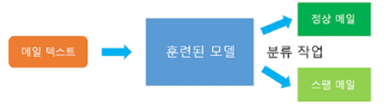

# 1. 텍스트 분류

- 텍스트를 입력받아, 텍스트가 어떤 종류의 범주(Class)에 속하는지를 구분하는 작업

- ex) 스팸 메일 분류

  > 

### 텍스트 분류 유형

- 이진 분류 : 범주가 2가지
- 다중 클래스 분류 : 분류해야 할 범주가 3가지 이상

 

 

### 다양한 텍스트 분류

- 감성 분석 : 리뷰가 긍정리뷰인지 부정 리뷰인지 분류
- 의도 분석 : 사용자의 의도를 질문, 명령, 거절과 같은 클래스로 분류

 

 

## 2. 개체명 인식(NER)

- 단어를 보고 그 단어가 어떤 유형인지 인식
- 사람+조직+시간 개체명 인식 모델로 아래 문장 수행
  - 손흥민은 2015년 토트넘에 입단했다
  - 손흥민 하면 이 내용이 떠오르도록